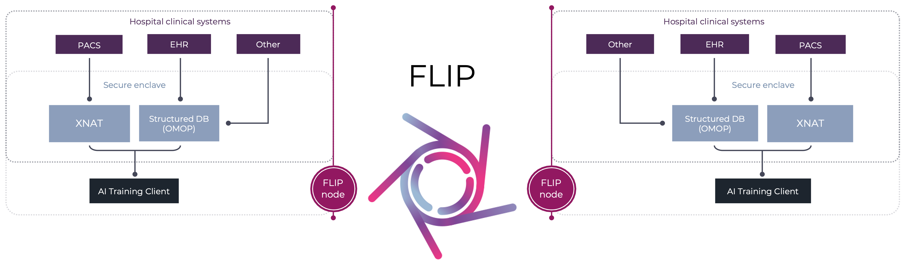

<!--
    Copyright (c) 2026 Guy's and St Thomas' NHS Foundation Trust & King's College London
    Licensed under the Apache License, Version 2.0 (the "License");
    you may not use this file except in compliance with the License.
    You may obtain a copy of the License at
        http://www.apache.org/licenses/LICENSE-2.0
    Unless required by applicable law or agreed to in writing, software
    distributed under the License is distributed on an "AS IS" BASIS,
    WITHOUT WARRANTIES OR CONDITIONS OF ANY KIND, either express or implied.
    See the License for the specific language governing permissions and
    limitations under the License.
-->

<p align="center"></p>

# Federated Learning and Interoperability Platform

[](https://opensource.org/licenses/Apache-2.0)
[](https://www.python.org/downloads/)
[](https://londonaicentreflip.readthedocs.io/en/latest/)
[](https://codecov.io/gh/londonaicentre/FLIP)

[](https://github.com/londonaicentre/FLIP/pkgs/container/flip-api)
[](https://github.com/londonaicentre/FLIP/pkgs/container/flip-ui)

[](https://github.com/londonaicentre/FLIP/pkgs/container/data-access-api)
[](https://github.com/londonaicentre/FLIP/pkgs/container/imaging-api)
[](https://github.com/londonaicentre/FLIP/pkgs/container/trust-api)

[](https://github.com/londonaicentre/FLIP/pkgs/container/orthanc)
[](https://github.com/londonaicentre/FLIP/pkgs/container/xnat-db)
[](https://github.com/londonaicentre/FLIP/pkgs/container/xnat-nginx)
[](https://github.com/londonaicentre/FLIP/pkgs/container/xnat-web)

FLIP is an open-source platform for federated training and evaluation of medical imaging AI models across healthcare institutions, while ensuring data privacy and security.

FLIP is developed by the [London AI Centre](https://www.aicentre.co.uk/) in collaboration with Guy's and St Thomas' NHS Foundation Trust and King's College London.

<p align="center"></p>

## Repositories

This repository is the FLIP mono-repo: Central Hub API, Trust APIs, UI, Docker deployment, **and** the federated
learning code (base library, FL services, and tutorials) that was previously split across `flip-fl-base` and
`flip-fl-base-flower`. The FL code now lives under [`flip-utils/`](flip-utils/) (the pip-installable `flip` package),
[`fl_services/`](fl_services/) (Docker services for FL server/client/API), and [`fl-apps/`](fl-apps/) (job-type
implementations and tutorials).

| Subdirectory | Description |
| --- | --- |
| [`flip-api/`](flip-api/) | Central Hub API service |
| [`flip-ui/`](flip-ui/) | Frontend UI |
| [`trust/`](trust/) | Trust-side services (trust-api, imaging-api, data-access-api, mock OMOP / Orthanc / XNAT) |
| [`deploy/`](deploy/) | Docker Compose and infrastructure-as-code (AWS / on-prem) |
| [`docs/`](docs/) | Sphinx documentation source (ReadTheDocs) |
| [`flip-utils/`](flip-utils/) | `flip` Python package — platform logic, NVFLARE components, Flower helpers |
| [`fl_services/`](fl_services/) | Docker images for FL networks: `fl-server`, `fl-client`, `fl-api-base`, `fl-base` |
| [`fl-apps/`](fl-apps/) | FL job-type implementations (`standard`, `evaluation`, `diffusion_model`, `fed_opt`) and tutorials |

The NVFLARE workspace is now provisioned in-tree at [`deploy/workspace`](deploy/workspace) (`make nvflare-provision`).
The legacy [`flip-fl-base-flower`](https://github.com/londonaicentre/flip-fl-base-flower) repository still holds the
provisioned Flower certs used at dev time — see [Federated Learning Setup](#federated-learning-setup) below.

## Deployment

### Prerequisites

- [Docker](https://docs.docker.com/get-docker/) with [Swarm mode](https://docs.docker.com/engine/swarm/) initialized
- [Nvidia Container Toolkit](https://docs.nvidia.com/datacenter/cloud-native/container-toolkit/latest/install-guide.html)
- [Make](https://formulae.brew.sh/formula/make)
- [UV](https://docs.astral.sh/uv) - Python environment management tool
- postgresql-client (install with `apt install postgresql-client postgresql-client-common` on Debian/Ubuntu)

> For developer tooling and IDE setup, see [CONTRIBUTING.md](CONTRIBUTING.md).

### Using the Makefile

To start the services, you can use the Makefile provided in the root directory. The Makefile provides several convenient commands to manage the services defined in the [deploy/compose.development.yml](deploy/compose.development.yml) file.

For example:

| Command | Description |
| --------- | ------------- |
| `make up` | Run all services using Docker Swarm for XNAT (⚠️ This will not build the images, use `make build` first if needed)|
| `make up-no-trust` | Run all services except the trust services related services |
| `make up-trusts` | Run the trust services related services (uses Docker Swarm for XNAT) |
| `make central-hub` | Run the central API service and the database (does not start the UI — use `make ui` for that) |
| `make ui` | Start the flip-ui container only (no-op when `PROD=stag`/`PROD=true`, since the UI is served from S3 + CloudFront) |
| `make ui-off` | Stop the flip-ui container |
| `make build` | Build all Docker images |
| `make down` | Stop all services and remove the containers (including Swarm stacks) |
| `make restart` | Stop and start all services |
| `make restart-no-trust` | Stop and start all services except the trust services related services |
| `make clean` | Remove all stopped containers, networks, and images |
| `make ci` | Run the CI pipeline locally using `act` |
| `make -C trust up-trust KIT=<CODE> PROD=<env>` | Run a trust on the local host pointing at a remote hub (kit file `trust/.env.<CODE>.<env>`; the on-prem trust kit is `trust/.env.<CODE>.production`) |
| `make new-trust TRUST_CODE=<CODE> TRUST_NAME="..."` | Scaffold a new trust kit file `trust/.env.<CODE>.<env>` from the base template |
| `make register-trusts` | Register the shipped dev roster (`trust/.env.*.development.example`, currently GSTT + KCH) on the running hub and write per-trust kit files (run automatically by `make up`) |
| `make register-trust KIT=<CODE>` | Register one trust on the running hub and fill its kit file (creds + hub-shared block) |
| `make unit_test` | Run unit tests across all services |
| `make tests` | Run flip-ui unit and e2e tests followed by the full flip-api test suite (lint + mypy + pytest) |
| `make e2e_smoke` | Drive a full project lifecycle (create → upload → train → download) against an already-running stack (not run in CI) |
| `make lock` | Regenerate every service's `uv.lock` from its `pyproject.toml` |
| `make debug SERVICE=<name>` | Restart one service in debug mode (waits for a debugger on port 5678). Services: `flip-api`, `fl-api-net-1`, `trust-api`, `imaging-api`, `data-access-api` |
| `make debug-off SERVICE=<name>` | Take a single service back out of debug mode |
| `make debug-all` | Restart every API service in debug mode |
| `make debug-off-all` | Take every API service back out of debug mode |

You can add new commands to the Makefile to create smaller deployments for testing and development.

### Docker Swarm Deployment

The XNAT services are deployed using Docker Swarm mode for better resource management and scalability. Docker Swarm is automatically used when running `make up` or `make up-trusts`.

**Key features of Swarm deployment:**

- Better resource allocation with CPU and memory limits
- Automatic service recovery with restart policies
- Overlay networking for secure service communication
- Support for multi-node deployment (if configured)

**Swarm-specific commands:**

- XNAT services are deployed as Docker stacks (`xnat1` and `xnat2`)
- The Swarm deployment uses the [trust/xnat/docker-compose-stack.yml](trust/xnat/docker-compose-stack.yml) file
- Networks are created as overlay networks with `--attachable` flag for flexibility

**Note:** Docker Swarm mode must be initialized on your system. If not already initialized, run:

```bash
docker swarm init
```

After that, you will need to restart the docker networks used by the services:

there is a command to create the networks, but you will need to remove them manually first if they are already running:

```bash
docker network rm deploy_trust-network-1
docker network rm deploy_trust-network-2
```

Then create the networks again:

```bash
make create-networks
```

To manually manage XNAT services (uses Docker Swarm):

```bash
cd trust/xnat
make up          # Start XNAT services
make down        # Stop XNAT services
make xnat-shell  # Get a shell in the XNAT container
```

### Trust Registration

The internal service key (for fl-server-to-hub authentication) must be generated before starting the platform:

```bash
make generate-internal-service-key
```

This writes `INTERNAL_SERVICE_KEY` and `INTERNAL_SERVICE_KEY_HASH` (plain strings) into `.env.development`. `make up` invokes `generate-internal-service-key` automatically.

Trusts are registered on the **running hub** rather than configured via env-file key dicts:

```bash
make register-trusts
```

`register-trusts` registers the shipped dev roster — every `trust/.env.*.development.example` kit (currently GSTT and KCH) — on the hub: for each, it inserts a `trust` row with its `api_key_hash`, claims an FL kit slot, and fills that trust's kit file `trust/.env.<CODE>.development` (with `TRUST_API_KEY`, `TRUST_INTERNAL_SERVICE_KEY`, `FL_KIT_SLOT`, `FL_KIT_SLOT_NUMBER`, `EXPECTED_TRUST_ID`). The kit files ARE the roster — trusts are not enumerated in the hub env file. To add another, run `make new-trust TRUST_CODE=<CODE> TRUST_NAME="..."` then `make register-trust KIT=<CODE>`. `make up` runs `register-trusts` automatically once the hub is up. See [`CLAUDE.md`](CLAUDE.md#trust-internal-service-authentication) for the trust-internal auth threat model.

### Basic Usage

To start the full platform locally:

```bash
make up
```

This will start all the services defined in the `deploy/compose.development.yml` file. The services will be started in detached
mode, so you can continue using your terminal. Use `docker compose ps` to see the status of the services and see which
ports they are running on.

To get a shell some of the services, you can run:

```bash
docker compose -f deploy/compose.development.yml exec < service-name > < command >
```

For example:

```bash
docker compose -f deploy/compose.development.yml exec flip-ui /bin/sh
```

This will give you a shell in the `flip-ui` container. You can run any command inside the container, including
installing new packages, running tests, and debugging the code.

To stop the services:

```bash
make down
```

If you want to run a single service you can run:

```bash
docker compose -f deploy/compose.development.yml run --rm < service name >
```

### Federated Learning Setup

The project supports [NVIDIA FLARE](https://developer.nvidia.com/flare) and [Flower Framework](https://flower.ai/) for
federated learning. FLARE requires provisioned certificates and configuration files that are generated in-tree via
`make nvflare-provision` (or `make nvflare-provision-2-nets` for a two-network setup, see
[`fl_services/README.md`](fl_services/README.md)) and stored in `deploy/workspace/`.

1. **Path Resolution**: `FL_PROVISIONED_DIR` is derived from the `FL_BACKEND` selection inside [`deploy/fl_backend.mk`](deploy/fl_backend.mk):

   - `FL_BACKEND=flower` → `../flip-fl-base-flower/certs` (sibling repo, not yet merged)
   - `FL_BACKEND=nvflare` → `deploy/workspace` (in-tree)

   The Makefile then converts the relative value to an absolute path so Docker volume mounts work correctly. You can override the resolved path at the command line for a one-off, e.g. `make up FL_PROVISIONED_DIR=/tmp/my-workspace`.

2. **Why This Matters**: Docker Compose cannot resolve relative paths for volume mounts, so the absolute path conversion is essential for FL services to access their provisioned certificates and configuration files.

If you see errors like "fed_client.json does not exist" or "missing startup folder", verify that:

- The workspace has been properly provisioned with NVFLARE certificates (`make nvflare-provision`)
- The `FL_PROVISIONED_DIR` path is correctly resolved (check Makefile output)
- For NVFLARE: the workspace is at `deploy/workspace/`

## AWS Deployment

### Staging environment

All commands run from `deploy/providers/AWS/`. The Makefile defaults to staging when `PROD` is unset.

**Prerequisites:**
- `~/.ssh/host-aws` SSH key configured
- `.env.stag` and per-service `.env` files present (see [deploy/README.md](deploy/README.md))
- `~/.aws/config` has a `[profile stag]` alias for the staging account
- `DOCKER_TAG` in `.env.stag` is a published GHCR tag (branch images don't auto-build — trigger `gh workflow run docker_build_flip_api.yml --ref <branch>` if needed)

**One-shot deploy:**

```bash
cd deploy/providers/AWS
export AWS_PROFILE=stag
make full-deploy PROD=stag
```

This runs the following steps in order:

| Step | Command | What it does |
|------|---------|--------------|
| 1 | `make github-login` | Authenticate with GitHub CLI |
| 2 | `make aws-login` | AWS SSO login |
| 3 | `make init` | Terraform init with the S3 backend |
| 4 | `make import-persistent` | Import pre-existing resources (Cognito, Secrets, S3 buckets) — idempotent, safe to re-run |
| 5 | `make plan` | Review the Terraform execution plan |
| 6 | `make apply` | Apply infrastructure changes |
| 7 | `make update-env` | Refresh `.env.stag` with Terraform outputs |
| 8 | `make ssh-config` | Write SSM-tunnelled `Host flip` / `Host flip-trust` into `~/.ssh/config` |
| 9 | `make ansible-init` | Configure Trust EC2 with Docker, CloudWatch, and FL assets |
| 10 | `make deploy-centralhub` | Force-redeploy ECS Fargate services + sync UI to S3 + invalidate CloudFront |
| 11 | `make register-trusts` | Register trusts on the hub and write per-trust kit files |
| 12 | `make deploy-trust` | Deploy trust stack to Trust EC2 via Docker Compose |
| 13 | `make status` | Health checks |

> **Stag note:** staging has ~70 resources missing from Terraform state. `make import-persistent` (step 4) handles this — it probes state before each import and skips already-imported resources, so re-running after a failure is safe.

For subsequent UI-only changes: `make deploy-ui PROD=stag` (no Terraform involved).

For production, replace `PROD=stag` with `PROD=true` and `AWS_PROFILE=prod` throughout.

For full details, prerequisites, and troubleshooting see [deploy/providers/AWS/README.md](deploy/providers/AWS/README.md).

### Hybrid deployment (on-premises trust + AWS hub)

To connect a local Ubuntu host as a trust against the AWS staging hub:

```bash
# One-shot hybrid deploy (auto-detects your public IP)
cd deploy/providers/AWS
make full-deploy-hybrid PROD=stag [LOCAL_TRUST_IP=<public-ip>]

# Then on the trust host: provision it, then start the stack
make provision-local-trust          # run ON the trust host
cd ../../..
env PROD=stag make -C trust up-trust KIT=<CODE>
```

No inbound firewall rules or NAT port-forwarding are needed on the trust host — all communication is outbound from the trust to the hub. See [deploy/providers/local/README.md](deploy/providers/local/README.md) for full details.

## Kubernetes Trust Deployment

> **Early-access.** The three blockers from the original k3s validation (`xnat-nginx` exiting after entrypoint, `xnat-web` crash-looping on a DB password mismatch, and the `fl-client` not holding its NVFLARE connection) are fixed on this branch — `Trust_K8s` now connects to the stag hub and runs healthy. Remaining work before production is tracked in [#593](https://github.com/londonaicentre/FLIP/issues/593) (deployment robustness: automated kit provisioning, egress-config persistence, hub-side fl-api hardening), [#516](https://github.com/londonaicentre/FLIP/issues/516) (NetworkPolicy audit), and [#530](https://github.com/londonaicentre/FLIP/issues/530) (RBAC/PodSecurity). The kernel-7 gRPC (#527), sidecar FL-client (#528), and XNAT/Orthanc Ingress (#529) issues were triaged and closed as out-of-scope.

A K8s trust uses the Helm chart in `deploy/providers/kubernetes/` and follows the same outbound-only architecture as Docker Compose trusts — no inbound ports are exposed from the cluster.

### 1. Register the trust on the hub

Run from the repo root. `<CODE>` is your trust name (e.g. `Trust_K8s`):

```bash
make new-trust TRUST_CODE=<CODE> TRUST_NAME="<Human Name>"
make -C deploy/providers/AWS register-trusts KIT=<CODE> PROD=stag
make sync-trust-kit KIT=<CODE> PROD=stag
```

This writes `trust/.env.<CODE>.stag` with the per-trust keys (`TRUST_API_KEY`, `TRUST_INTERNAL_SERVICE_KEY`) and the hub-shared block (`AES_KEY_BASE64`, `CENTRAL_HUB_API_URL`, FL settings). Registration is idempotent — safe to re-run.

### 2. Provide infrastructure secrets

Create `deploy/providers/kubernetes/values-secrets.yaml` with the secrets the kit doesn't own. The required keys are:

| Secret key | Purpose |
|-----------|---------|
| `omop-postgres-password` | OMOP PostgreSQL password |
| `data-access-postgres-password` | Data-access reader DB password |
| `orthanc-registered-users` | Orthanc registered users (JSON) |
| `xnat-admin-password` | XNAT admin password |
| `xnat-service-user` / `xnat-service-password` | XNAT service account |
| `xnat-datasource-password` | XNAT PostgreSQL password |
| `grafana-admin-password` | Grafana admin password |
| `s3-access-key-id` / `s3-secret-access-key` | AWS credentials for the fl-client S3 kit-sync init container |

The per-trust keys (`aes-key-base64`, `trust-api-key`, `trust-internal-service-key*`) are patched into the cluster Secret by `sync-kit` in the next step — do not add them to `values-secrets.yaml`.

### 3. Sync the kit into the cluster

```bash
make -C deploy/providers/kubernetes sync-kit KIT=<CODE> PROD=stag
```

This reads `trust/.env.<CODE>.stag`, patches the per-trust keys into the Kubernetes Secret (`trust-release-flip-trust-secrets`), and writes a secret-free Helm override file `deploy/providers/kubernetes/k8s-trust-<CODE>.yaml`.

### 4. Deploy the chart

```bash
make -C deploy/providers/kubernetes deploy-trust-k8s KIT=<CODE> PROD=stag
```

This runs `helm upgrade --install` with the generated override and then
`patch-kit-secrets` (which injects the per-trust keys into the Helm-owned Secret
and restarts the API deployments). Equivalent raw Helm for the install step:

```bash
helm upgrade --install trust-release ./deploy/providers/kubernetes/ \
  --namespace flip-trust --create-namespace \
  -f deploy/providers/kubernetes/values.yaml \
  -f deploy/providers/kubernetes/values-secrets.yaml \
  -f deploy/providers/kubernetes/k8s-trust-<CODE>.yaml
```

> **⚠️ First-time / clean-install rough edges** (tracked in [#595](https://github.com/londonaicentre/FLIP/issues/595)):
> - `sync-kit` (step 3) creates the Secret via `kubectl`, which a *fresh* `helm
>   install` cannot adopt (`missing key "app.kubernetes.io/managed-by"`). On a
>   clean namespace, delete it first so Helm owns it:
>   `kubectl delete secret trust-release-flip-trust-secrets -n flip-trust`.
> - If the `xnat-init` post-install hook fails, `helm` reports the release failed
>   and `patch-kit-secrets` is skipped — trust-api then polls with the stale seed
>   key and gets `401`. Re-run it manually:
>   `make -C deploy/providers/kubernetes patch-kit-secrets KIT=<CODE> PROD=stag`.

### 5. Verify the trust is polling

```bash
kubectl get pods -n flip-trust
kubectl logs -n flip-trust -l app.kubernetes.io/component=trust-api
# Expect: POST .../api/trust/heartbeat "HTTP/1.1 200 OK"
#         GET  .../api/tasks/pending   "HTTP/1.1 200 OK"
```

A `401 "API key is missing"` means the API-key header is mismatched — check `TRUST_API_KEY_HEADER` in your override file.

### 6. (FL training only) Open the FL-server NLB

Polling works without any firewall change. For FL training, the fl-client must reach the hub's FL server. Add the K8s node's egress IP to `K8S_TRUST_PUBLIC_IPS` in `.env.stag` (an HCL list, e.g. `K8S_TRUST_PUBLIC_IPS=["1.2.3.4"]`), then reconcile the NLB security group:

```bash
make -C deploy/providers/AWS add-k8s-trust K8S_TRUST_IP=<node-egress-ip> PROD=stag
```

This runs a normal `terraform apply` (no `-target`), so re-running with an already-listed IP is a no-op. If the node's egress IP changes, add the new one to the list and re-run.

For full configuration reference, secrets management, troubleshooting, and known limitations see [deploy/providers/kubernetes/README.md](deploy/providers/kubernetes/README.md).

## Project Structure

The repository is organised as follows:

- `deploy`: Contains the Docker deployment and infrastructure files
- `docs`: Contains the documentation files
- `flip-api`: Contains the central hub API service
- `flip-ui`: Contains the UI service
- `flip-utils`: Contains the pip-installable flip-utils Python library
- `fl_services`: Contains the FL Docker services (server, client, admin API)
- `fl-apps`: Contains FL app templates, tutorials, and utility scripts
- `trust`: Contains the services that would be deployed in individual trust environments.
  - `data-access-api`: Contains the data access API service
  - `imaging-api`: Contains the imaging API service
  - `observability`: Contains the observability stack (Grafana, Loki, Alloy)
  - `omop-db`: Contains a mocked OMOP database
  - `orthanc`: Contains a mocked PACS service (uses [Orthanc](https://www.orthanc-server.com/))
  - `trust-api`: Contains the trust API service
  - `xnat`: Contains a mocked [XNAT](https://www.xnat.org/) service
- `flip-utils`: The `flip` Python package — platform logic, NVFLARE components, Flower helpers (migrated from `flip-fl-base`)
- `fl_services`: Docker images for FL networks — `fl-server`, `fl-client`, `fl-api-base`, `fl-base` (migrated from `flip-fl-base`)
- `fl-apps`: FL job-type implementations (`standard`, `evaluation`, `diffusion_model`, `fed_opt`) and runnable tutorials

### Trust Authentication

Trusts authenticate to the Central Hub using per-trust API keys. All trust communication is outbound — trusts poll the hub over HTTPS at the canonical subdomain (e.g. `https://app.flip.aicentre.co.uk/api/...`), which is fronted by CloudFront and proxied to the ALB. See [CLAUDE.md](CLAUDE.md) for the full authentication model and [deploy/providers/local/README.md](deploy/providers/local/README.md) for on-premises trust deployment.

## Contributing

We welcome contributions from the community. See [CONTRIBUTING.md](CONTRIBUTING.md) for guidance on setting up a
development environment, adding new services, coding standards, testing practices, and the pull request process.

## Further Resources

- [Full Documentation](https://londonaicentreflip.readthedocs.io/en/latest/)
- [AWS Deployment Guide](deploy/README.md)
- [Debugging Guide](DEBUG.md)
- [Security & Secrets](scripts/README.md)
- [London AI Centre](https://www.aicentre.co.uk/)
