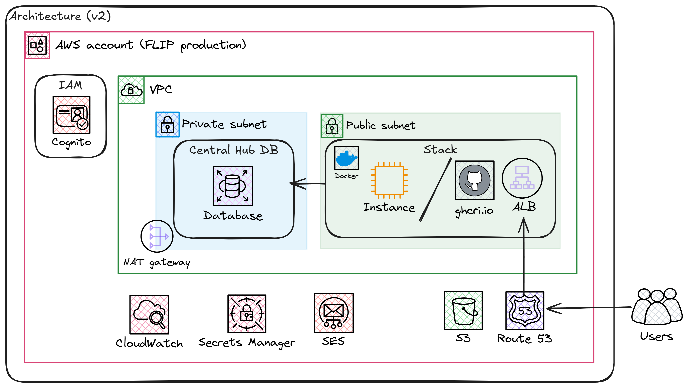

<!--
    Copyright (c) 2026 Guy's and St Thomas' NHS Foundation Trust & King's College London
    Licensed under the Apache License, Version 2.0 (the "License");
    you may not use this file except in compliance with the License.
    You may obtain a copy of the License at
        http://www.apache.org/licenses/LICENSE-2.0
    Unless required by applicable law or agreed to in writing, software
    distributed under the License is distributed on an "AS IS" BASIS,
    WITHOUT WARRANTIES OR CONDITIONS OF ANY KIND, either express or implied.
    See the License for the specific language governing permissions and
    limitations under the License.
-->

# FLIP AWS Terraform/OpenTofu and Ansible Infrastructure

Terraform/OpenTofu and Ansible Infrastructure as Code to deploy the FLIP application stack to AWS.

This provider manages the **Central Hub** (always in AWS) and, optionally, one or more **Trust** instances. Trust services can be deployed in two ways:

| Deployment Model | Trust Location | Managed By |
| --- | --- | --- |
| **Cloud** | AWS EC2 (same account as Central Hub) | This provider (`deploy/providers/AWS/`) |
| **Hybrid / On-Premises** | Any Ubuntu host (home lab, hospital server, etc.) | [`deploy/providers/local/`](../local/README.md) + selected targets in this Makefile |

In both models, trusts poll the Central Hub for tasks over HTTPS — all communication is **outbound from the trust** to the hub. The hub never makes inbound requests to trusts.

## Prerequisites

1. **AWS CLI configured** with SSO access (see [deploy README](../../README.md))
2. **Terraform >= 1.13.1** or OpenTofu installed
3. **Python 3.12+**
4. **UV environment manager** installed via [uv installation guide](https://docs.astral.sh/uv/guides/install-python/)
5. **GitHub CLI** installed via [GitHub CLI installation guide](https://cli.github.com/)
6. **SSH key pair** created at `~/.ssh/host-aws` (see [deploy README](../../README.md))
7. **Environment files** configured: (see [deploy README](../../README.md))
   - `.env.stag` (staging) or `.env.production` (production) in project root
   - Service-specific `.env` files (see Environment Configuration section)

### Required AWS Permissions

Your AWS IAM role/user needs the following permissions for provisioning infrastructure:

- **SSM**: `ssm:GetParameter` for fetching AMI IDs; `ssm:PutParameter` / `ssm:GetParameter` on the Parameter Store entries consumed by ECS tasks
- **EC2 / VPC**: Full access (VPC, instances, security groups, key pairs, Elastic IPs, NAT gateway, interface + gateway VPC endpoints)
- **RDS**: `rds:CreateDBSubnetGroup`, `rds:CreateDBParameterGroup`, `rds:CreateDBInstance`
- **CloudWatch Logs**: `logs:*` (ECS task logs and WAF logs both land here)
- **Secrets Manager**: Full access for storing database credentials and API secrets
- **IAM**: Create and manage roles for EC2 instances and ECS task execution / task roles
- **Application + Network Load Balancers**: Create and manage both the ALB (HTTPS API traffic) and the NLB (FL server TCP/gRPC traffic)
- **ECS / Fargate**: `ecs:*` (cluster, task definitions, services); ECR pull for ECS task images
- **EFS**: `elasticfilesystem:*` for the shared workspace volumes mounted into FL Fargate tasks
- **CloudFront + WAFv2**: Create and manage the UI distribution and the WebACL attached to it
- **ACM**: Issue / import certificates in both `eu-west-2` (ALB origin) and `us-east-1` (CloudFront viewer)
- **Route53**: Manage A-records for the canonical subdomain (CloudFront alias) and the FL-server NLB
- **Service Discovery (Cloud Map)**: Create the private DNS namespace used for ECS task-to-task resolution
- **SES**: Manage email templates (optional for email functionality)

Managed policies that cover these requirements:

- `AmazonEC2FullAccess`
- `AmazonECS_FullAccess`
- `AmazonRDSFullAccess`
- `AmazonElasticFileSystemFullAccess`
- `CloudWatchLogsFullAccess`
- `SecretsManagerReadWrite`
- `IAMFullAccess`
- `ElasticLoadBalancingFullAccess` (covers ALB and NLB)
- `CloudFrontFullAccess`
- `AWSWAFFullAccess`
- `AWSCertificateManagerFullAccess`
- `AmazonRoute53FullAccess`
- `AWSCloudMapFullAccess`
- `AmazonSSMFullAccess`
- `AmazonSESFullAccess` (optional)

**Note**: The deployed EC2 instances use separate, scoped IAM roles following the principle of least privilege:

- **Central Hub** (`ec2-role`): SSM + CloudWatch managed policies, plus inline policies for `secretsmanager:GetSecretValue` on the FLIP API and DB secrets, Cognito user-pool admin actions on the FLIP user pool, S3 object access on the three FLIP application buckets (see [FLIP application S3 buckets](#flip-application-s3-buckets)) and the AI Centre bucket, and `ses:SendEmail` on the verified sender identity.
- **Trust EC2** (`trust-ec2-role`): SSM + CloudWatch managed policies, plus a read-only S3 inline policy on the AI Centre bucket for FL participant-kit downloads. No Cognito, SES, Secrets Manager or FLIP application bucket access.

## Deployment Workflow

### Full Stack Deployment

The complete deployment process is automated via the `full-deploy` target:

```bash
cd deploy/providers/AWS
make full-deploy PROD=stag  # For staging
# OR
make full-deploy PROD=true  # For production
```

This command executes the following steps in order:

1. **`github-login`**: Authenticate with GitHub CLI
2. **`aws-login`**: Authenticate with AWS SSO
3. **`init`**: Initialize Terraform with environment-specific S3 backend
4. **`import-persistent`**: Import existing persistent AWS resources to prevent replacement
5. **`plan`**: Generate and review the initial Terraform execution plan
6. **`apply`**: Apply infrastructure changes
7. **`update-env`**: Refresh the root environment file with Terraform outputs
8. **`ssh-config`**: Update `~/.ssh/config` with EC2 instance IPs
9. **`ansible-init`**: Configure EC2 instances with Docker, CloudWatch, and FL assets (Trust EC2 only — the Central Hub no longer runs application containers on its EC2 host)
10. **`deploy-centralhub`**: Force-redeploy the Central Hub ECS Fargate services (`flip-api`, `fl-api-net-1`, `fl-server-net-1`) and sync the UI to S3 + invalidate CloudFront
11. **`deploy-trust`**: Deploy Trust services via Docker Compose to the Trust EC2
12. **`status`**: Run comprehensive health checks

### flip-ui on S3 + CloudFront

The UI is served from S3 behind CloudFront at the canonical user-facing subdomain (`stag.flip.aicentre.co.uk` / `app.flip.aicentre.co.uk`). CloudFront also forwards `/api/*` to the ALB, using a backend-only `api.<subdomain>` DNS name that only CloudFront uses — trusts and users never see it. CloudFront is the only supported UI-hosting path; there is no legacy EC2 UI container or ALB UI target group to fall back to.

**Subsequent UI deploys**: just `make deploy-ui PROD=stag|true` — builds the UI from the working tree, regenerates `window.js`, syncs to S3, invalidates CloudFront. No Terraform involved.

### FLIP application S3 buckets

The Central Hub uses four S3 buckets, each with a distinct purpose, access pattern, and CORS surface. The three **FLIP application buckets** were split out of a single legacy `flip{env}` bucket so each tenant can carry the minimum CORS surface its consumer needs (a CORS change for one tenant no longer drags every other tenant along, and a browser-direct bucket can no longer accidentally expose objects belonging to a server-only flow).

| Bucket (per env) | Env-var (`.env.{stag,production}`) | Consumer | Browser CORS | Holds |
|---|---|---|---|---|
| `flip{env}-model-files-uploads` | `FLIP_MODEL_FILES_UPLOADS_BUCKET_NAME` | researcher browser (presigned **PUT** on `origin/develop`; flips to presigned **POST** once [#438](https://github.com/londonaicentre/FLIP/pull/438) lands), flip-api reads | `PUT` today; narrows to `POST` from `https://<flip_alb_subdomain>` when #438 merges | researcher-uploaded model artefacts under `uploaded/` (today the AV-scanned copy reads from the same prefix — see the FIXME in `.env.production`) |
| `flip{env}-fl-results` | `FLIP_FL_RESULTS_BUCKET_NAME` | fl-server writes, researcher browser (presigned **GET**) | `GET` from `https://<flip_alb_subdomain>` | FL training output / aggregated weights — the whole bucket is dedicated to this tenant so no prefix is needed |
| `flip{env}-app-bundles` | `FLIP_APP_BUNDLES_BUCKET_NAME` | flip-api (boto3 only); `flip-fl-base{,-flower}` CI publishes here on merge to main | **none** (server-only — no `aws_s3_bucket_cors_configuration` resource is emitted at all) | `base-application/{nvflare,flower}/` (pushed by the upstream FL repos), `app_destinations/<model_id>/` (per-bundle FL apps), `base-application-dev/pull-requests/<n>/` (PR previews on the dev account) |
| `flip{env}-aicentre` | `AICENTRE_BUCKET_NAME` | Trust EC2 (`aws s3 cp` during Ansible), AI Centre operators | `PUT`, `GET` | FL participant kits |

All four share standard configs: public access blocked, SSE-KMS server-side encryption with bucket keys enabled, versioning enabled. The three FLIP application buckets are rendered by the shared **`modules/flip_s3_bucket`** module, which is consumed by both `main.tf` (prod / stag) and `dev/main.tf` (dev account) — so a CORS or bucket-policy change plans identically across every environment, closing the dev-drift gap that masked the presigned-PUT → presigned-POST regression in #438.

**Where the bucket-names come from outside FLIP itself.** `flip-fl-base` and `flip-fl-base-flower` push their `src/` tree to `flip{env}-app-bundles/base-application/{nvflare,flower}/` on every merge to `main`. The bucket name is computed in the workflow YAML as `${{ vars.AWS_*_S3_BUCKET_NAME }}-app-bundles` — the `AWS_*_S3_BUCKET_NAME` GitHub Environment variable still holds the legacy bucket name, and the `-app-bundles` suffix is appended in-place. That way the variable can stay set to the legacy bucket (still consulted by other migration tooling) without the FL-base workflow accidentally writing back to it. The GitHub OIDC role those workflows assume (`GitHubAction-AssumeRoleWithAction-FLIP`, defined in the `aicentre-iac` repo) attaches the AWS-managed `AmazonS3FullAccess` policy, so no IAM change is needed when new app-bundles buckets come online in a new env.

#### Migrating off the legacy single-bucket layout

For an account that was created **before** the split, the legacy `flip{env}` bucket holds the contents that now belong in the three split buckets above. **Prod and dev were migrated as part of FLIP#24** (the bucket-split PR) — see that PR's description for the as-built details and verification logs. The only environment still pending a cutover at the time of writing is **stag**; the runbook below is the canonical reference for stag and for any future fresh prod/dev account that needs the same migration.

The mechanism the runbook leans on:

- The `removed { destroy = false }` blocks in `services.tf` drop the legacy bucket from Terraform state on the first apply **without** destroying the AWS resource — that's what lets `make migrate-flip-bucket` run against the still-live source.
- `make verify-flip-bucket-migration` is the safety net for the fact that `aws s3 sync` exits 0 even when individual object copies fail (per-object KMS / throttle / timeout errors print to stderr but don't fail the sync). It computes a key-set subset check — every source key must exist on the destination; extras on the destination from post-cutover writes are allowed. Always green before `aws s3 rb`.
- There is a brief window between `make apply` finishing and `make deploy-centralhub` finishing where flip-api's IAM no longer grants the legacy bucket but its env vars still point at it — every S3 call returns 403 during that window (~5 minutes). To eliminate it, temporarily add the legacy bucket back to the IAM grant for the duration of the deploy, then strip it in a follow-up apply.

#### Stag migration runbook

Stag's Terraform state is known to be missing ~70 live resources. The `removed` blocks plan as no-ops if `aws_s3_bucket.flip_bucket` was never registered in stag state to begin with — and the next stag apply would then try to *create* whatever `FLIP_MODEL_FILES_UPLOADS_BUCKET_NAME` points to. If that's set to the legacy bucket name as a typo, the apply fails on `BucketAlreadyOwnedByYou`; if it's set to a new name but the new buckets already exist in AWS from a manual create, the apply also fails. The fix is to import every persistent resource first, then run apply / migrate / verify.

```bash
cd deploy/providers/AWS
export AWS_PROFILE=stag && make aws-login              # if SSO has expired

# 1. Bring stag's Terraform state in line with what's actually in AWS — this
#    imports the three new application buckets (if a previous run created them
#    manually), the AI Centre bucket, Secrets Manager, Cognito, SES, and ACM.
#    It does NOT import the legacy `aws_s3_bucket.flip_bucket` (that resource
#    has been removed from the configuration and replaced with `removed`
#    blocks). The `removed` blocks then plan as no-ops on the stag-state gap,
#    which is fine: nothing to remove means nothing accidentally gets removed.
#    Idempotent: rerun safely after a fix.
make import-persistent                                  # PROD unset → stag (see Makefile defaults)

# 2. Plan — confirm the diff matches the prod cutover's shape:
#    17 to add (3 new buckets), 3 to change (IAM rewires), 1 to destroy
#    (old uploaded_federated_data SSM param renamed), 8 forgotten-from-state.
#    If you see anything trying to DESTROY a bucket, stop — that means the
#    import-persistent step missed something. Don't apply.
make plan

# 3. Apply — same diff as prod.
make apply

# 4. Sync the four legacy prefixes (model_files/uploaded, uploaded_federated_data,
#    base-application, app_destination_bucket) into the three new buckets.
make migrate-flip-bucket

# 5. Parity-check — must print all-✅ before continuing.
make verify-flip-bucket-migration

# 6. Redeploy stag's central hub so flip-api picks up the new bucket env vars.
make deploy-centralhub

# … browser smoke against stag's URL; FL e2e; 24–48h cooldown …

# 7. Final verify + decommission.
make verify-flip-bucket-migration
aws s3 rm s3://flipstag --recursive
aws s3 rb s3://flipstag
```

Two stag-specific watch-outs:

- **`make import-persistent` failing partway through** is fine on a re-run — every import in `scripts/import-resources.sh` is idempotent (probes `terraform state list` before importing). The script will skip already-imported resources and only attempt the missing ones.
- **The deploy-centralhub redeploy needs the docker image tag pinned in `.env.stag`** (`DOCKER_TAG`) to be a tag that exists in GHCR. Branch tags do **not** auto-build on push — trigger the `docker_build_*` workflows via `workflow_dispatch` first if you're stag-testing a feature branch (see [the build trigger note in CLAUDE.md](../../../CLAUDE.md#docker-image-builds-manual-trigger-required-for-branches)).

For a **future fresh prod or dev** account that needs the same migration, the flow is the stag runbook above minus step 1 (`make import-persistent` is only needed on environments with the stag-style state gap) and with `PROD=true` on every `make` call for prod (dev uses the separate `deploy/providers/AWS/dev/` Terraform root, no `PROD=` flag).

> **Do not `aws s3 rb s3://flipdev` on the legacy dev bucket.** The `test-data/` prefix in there (~42 objects) is consumed by `flip-fl-base` and `flip-fl-base-flower` (their CI fixtures), so it is outside the scope of the FLIP#24 migration and must survive. Either leave the `flipdev` bucket alive solely for `test-data/`, or move `test-data/` to a dedicated bucket and update both FL-base repos' references in lockstep before any `aws s3 rb`. The same constraint may apply to a `test-data/` prefix in `flipstag` / `flipprod` if one exists — check with `aws s3 ls s3://flipstag/test-data/` before decommissioning either.

Once a decommission is complete in every environment, drop the `FLIP_BUCKET_NAME` line from `.env.*`, the `removed` blocks in `services.tf`, and the `migrate-flip-bucket` / `verify-flip-bucket-migration` Makefile targets in a follow-up PR.

### Manual Step-by-Step Deployment

For debugging or selective deployment, run individual steps:

```bash
# 0. Choose the environment for this shell.
# If you omit PROD, the AWS provider Makefile defaults to staging.
export PROD=stag    # or: export PROD=true

# 1. Login to GitHub and AWS
make github-login
make aws-login

# 2. Bootstrap the Terraform backend bucket once, if needed
make create-backend

# 3. Initialize Terraform (uses the configured S3 backend)
make init

# 4. Import existing persistent resources (prevents replacement errors)
make import-persistent

# 5. Plan changes
make plan

# 6. Apply infrastructure
make apply

# 7. Configure SSH access
make ssh-config

# 8. Setup EC2 instances with Ansible
make ansible-init

# 9. Deploy services
make deploy-centralhub
make deploy-trust

# 9. Check status
make status
```

### Deployment to Different Environments

**Staging:**

```bash
make full-deploy PROD=stag
```

**Production:**

```bash
make full-deploy PROD=true
```

The `PROD` variable determines which environment files are loaded:

- `PROD=stag` → Uses the root `.env.stag`
- `PROD=true` → Uses the root `.env.production`

If `PROD` is omitted when running the AWS provider Makefile, it defaults to staging.

The Makefile maps `PROD` onto `TF_VAR_environment` (`prod` when `PROD=true`, otherwise `stag`). Terraform branches on this variable to gate prod-only RDS hardening — see [RDS lifecycle](#rds-lifecycle-stag-vs-prod).

#### AWS profile aliases

The Makefile guards refuse to apply unless `AWS_PROFILE` matches the expected profile for the chosen environment. Defaults are the short logical names `prod`, `stag`, and `dev` — add these aliases to `~/.aws/config` so commands like `AWS_PROFILE=stag make plan` work without thinking about account numbers:

```ini
[profile prod]
sso_session = FLIP
sso_account_id = <prod-sso-account-id>
sso_role_name = <sso-role-name>
region = <aws-region>
output = json

[profile stag]
sso_session = FLIP
sso_account_id = <stag-sso-account-id>
sso_role_name = <sso-role-name>
region = <aws-region>
output = json

[profile dev]
sso_session = FLIP
sso_account_id = <dev-sso-account-id>
sso_role_name = <sso-role-name>
region = <aws-region>
output = json
```

Replace each `<…>` with the matching value from the FLIP AWS account directory (kept out of the public repo).

If your local profile names differ, override the defaults via `PROD_AWS_PROFILE`, `STAG_AWS_PROFILE`, or `DEV_AWS_PROFILE` (in your env file or on the make command line).

**Dev account (Cognito + SES only):**

The dev AWS account runs only the services that cannot reasonably run locally (Cognito for auth, SES for email). A separate, minimal Terraform root lives in [`dev/`](./dev/README.md) and calls the same `modules/cognito` and `modules/ses` as this stack, so a change to either service lands in both environments from one place. The dev stack reuses `.env.development` — the same env file the local Docker Compose dev stack consumes — so there is no extra file to maintain.

The dev stack has its own Makefile; drive it from the `dev/` directory:

```bash
cd deploy/providers/AWS/dev
make create-backend  # one-time, if the backend bucket needs bootstrapping
make init            # one-time, or after backend config changes
make plan
make apply
```

See [`dev/README.md`](./dev/README.md) for the one-time `terraform import` workflow that pulls the manually-created dev Cognito pool into state.

### Terraform module layout

```
deploy/providers/AWS/
├── main.tf                     # VPC, IGW, NAT, subnets, RDS, Secrets, ALB, NLB, Route53, Central Hub + Trust EC2
├── services.tf                 # Cognito + SES (delegated to modules), S3 buckets, IAM bindings
├── ecs.tf                      # ECS cluster + Fargate capacity providers
├── ecs_services.tf             # ECS Fargate services: flip-api, fl-api-net-1, fl-server-net-1
├── ecs_tasks.tf                # ECS task definitions for the Central Hub services
├── ecs_efs_provision.tf        # Bootstrapping job that seeds the EFS volumes
├── ecs_sg.tf                   # ECS task security groups (per-service)
├── efs.tf                      # EFS file systems + access points for shared FL workspace volumes
├── iam_ecs.tf                  # IAM execution + task roles for ECS Fargate tasks
├── parameter_store.tf          # SSM Parameter Store entries consumed by ECS tasks (bucket URIs, internal URL, etc.)
├── service_discovery.tf        # Cloud Map private DNS namespace (flip.local) for ECS task-to-task resolution
├── vpc_endpoints.tf            # Interface endpoints (Secrets Manager, SSM, CloudWatch Logs, ECR API + DKR) + S3 gateway endpoint
├── dhcp.tf                     # VPC DHCP option set
├── locals.tf                   # Shared locals
├── cloudfront.tf               # CloudFront distribution for flip-ui + attached WAFv2 WebACL
├── certificate.tf              # ACM certificates (ALB in eu-west-2, CloudFront viewer in us-east-1)
├── modules/
│   ├── cognito/                # shared: pool, domain, client, seed users
│   ├── ses/                    # shared: sender identity, transactional templates
│   ├── secgroup/               # shared: security-group wrapper
│   ├── flip_s3_bucket/         # shared: opinionated FLIP application S3 bucket
│   └── trust_ec2/              # prod/stag only: Trust EC2 host
└── dev/                        # dev-account root (calls cognito + ses modules)
```

The Central Hub application services (`flip-api`, `fl-api-net-1`, `fl-server-net-1`) run on **ECS
Fargate** today. The `aws_instance.ec2_instance` Central Hub EC2 still exists in the stack but no
longer fronts user traffic — the ALB's `target_groups` is empty for instance targets, and both the
ALB's `/api/*` rule and the NLB's FL-server listener forward to ECS Fargate `target_type=ip` target
groups (`aws_lb_target_group.ecs_flip_api`, `aws_lb_target_group.ecs_fl_server_tcp`).

The Cognito and SES resources used to live at the root of the prod/stag stack. `services.tf` and `main.tf` ship `moved` blocks that re-anchor the old root addresses onto the new `module.cognito.*` / `module.ses.*` paths, so any state still on the old layout self-heals on the next plan — no manual `terraform state mv` needed. `scripts/import-resources.sh` already targets the module addresses, so a fresh import lands in the right place too.

### Destroy Infrastructure

The destroy process preserves critical resources (Cognito, Secrets, S3) while safely removing infrastructure:

```bash
make destroy
```

**What gets destroyed:**

- Trust EC2 instance
- Central Hub EC2 instance
- ECS Fargate cluster, services, task definitions, and EFS file systems
- Application Load Balancer (ALB) and Network Load Balancer (NLB)
- CloudFront distribution + WAFv2 WebACL
- Cloud Map private DNS namespace
- VPC interface + gateway endpoints
- RDS database (in `stag` only — `prod` is protected, see [RDS lifecycle](#rds-lifecycle-stag-vs-prod))
- VPC, subnets, security groups, NAT gateway
- IAM roles and policies (EC2 + ECS execution/task roles)
- SSM Parameter Store entries
- Elastic IPs

**What gets preserved:**

- Cognito User Pool and users (authentication data)
- Secrets Manager secret (FLIP_API configuration)
- S3 buckets — both the application buckets and the AI Centre bucket (see [FLIP application S3 buckets](#flip-application-s3-buckets))

#### RDS lifecycle (stag vs prod)

The RDS instance behaves differently per environment, driven by `TF_VAR_environment`:

| Setting                            | `stag` (default) | `prod` (`PROD=true`)              |
|------------------------------------|------------------|-----------------------------------|
| `skip_final_snapshot`              | `true`           | `false`                           |
| `deletion_protection`              | `false`          | `true`                            |
| `final_snapshot_identifier_prefix` | `flip-database-final` | `flip-database-final`        |

In production, `terraform destroy` (or any `make destroy` against the prod account) will refuse to delete the RDS instance until deletion protection is removed manually, and a final snapshot named `flip-database-final-<suffix>` is taken before deletion. Staging stays disposable so trees can be torn down and rebuilt without snapshot cleanup.

### Status Checking

The deployment includes a comprehensive Python-based status checker:

```bash
make status
```

This validates:

- ✅ Terraform state and outputs
- ✅ VPC, subnets, and security group configurations
- ✅ EC2 instance health (Central Hub and Trust)
- ✅ RDS database connectivity
- ✅ Secrets Manager access
- ✅ S3 bucket accessibility
- ✅ Cognito User Pool configuration
- ✅ Docker services on EC2 instances
- ✅ HTTP endpoint availability
- ✅ SSH connectivity
- ✅ CloudWatch Logs configuration

### Accessing Trust Services (XNAT, Orthanc, Swagger Docs)

The Trust EC2 is in a private subnet with no inbound ports open. All Trust web UIs and API swagger docs are reachable via AWS Systems Manager (SSM) port forwarding.

**Prerequisites** (one-time setup):

1. AWS CLI installed and configured (`aws configure sso`)
2. AWS SSM Session Manager plugin installed:

   ```bash
   curl "https://s3.amazonaws.com/session-manager-downloads/plugin/latest/ubuntu_64bit/session-manager-plugin.deb" -o /tmp/session-manager-plugin.deb
   sudo dpkg -i /tmp/session-manager-plugin.deb
   ```

**Open all port forwards in one command:**

```bash
cd deploy/providers/AWS
make forward-trust
```

This prints a list of URLs you can paste into your browser:

| Service | Local URL | Purpose |
| --- | --- | --- |
| XNAT | `http://localhost:8104` | Neuroimaging platform UI |
| Orthanc | `http://localhost:8042` | DICOM server UI |
| trust-api swagger | `http://localhost:8020/docs` | Trust API documentation |
| imaging-api swagger | `http://localhost:8001/docs` | Imaging API documentation |
| data-access-api swagger | `http://localhost:8010/docs` | Data access API documentation |
| Grafana | `http://localhost:3000` | Observability dashboards |

Press Ctrl+C to stop all forwards. The Central Hub UI and API are accessed directly via the public ALB domain (e.g. `https://app.flip.aicentre.co.uk`) — no port forwarding needed.

## Hybrid Deployment: Adding an On-Premises Trust

To connect a local (on-premises) Trust host to the AWS Central Hub:

Recommended orchestration target (works for both `PROD=stag` and `PROD=true`):

```bash
cd deploy/providers/AWS
make full-deploy-hybrid PROD=<stag|true> LOCAL_TRUST_IP=<public-ip> [LOCAL_TRUST_SSH_KEY=~/.ssh/trust_key]
```

This wrapper target runs the full AWS deployment, provisions the local trust, and redeploys the Central Hub so the new secret values are loaded. `PROD` is inherited from the environment — omit `LOCAL_TRUST_IP` to auto-detect the operator machine's public IP via `curl ipify.org`.
You still need to:

1. Start the trust stack on the host: `cd trust && env PROD=<stag|true> make up-local-trust`
2. Verify the trust can poll the hub (check trust-api logs for successful task polling)

Or run provisioning directly:

```bash
cd deploy/providers/AWS

# Remote host (via SSH)
make add-local-trust LOCAL_TRUST_IP=<public-ip> LOCAL_TRUST_SSH_KEY=~/.ssh/trust_key

# Local machine (no SSH)
set -x ANSIBLE_BECOME_PASS (read -s -P 'Sudo password: ')
make add-local-trust LOCAL_TRUST_IP=<public-ip>
```

After provisioning, complete the manual steps printed by the target:

1. Start the trust stack on the host: `cd trust && env PROD=stag make up-local-trust`
2. Verify the trust can poll the hub (check trust-api logs for successful task polling)

Full details are in the [local provider README](../local/README.md).

## Troubleshooting

### Quick Diagnosis

First, run the automated status check script to identify issues:

```bash
make status
```

This will automatically diagnose:

- AWS resource health
- Network connectivity
- Application endpoint availability
- Docker container status
- System resource usage

Review the output for failed checks and follow the specific troubleshooting steps below.

### Detailed Troubleshooting Guide

For known failure modes encountered during staging/production deployment — including Terraform state
drift, ECS service errors, CloudFront cache invalidation, RDS connectivity, and SSM Session Manager
issues — see [`TROUBLESHOOTING.md`](TROUBLESHOOTING.md). Each entry includes symptoms, root cause, and
fix.

## Architecture

### Services

The platform supports a cloud-only setup (Central Hub + Trust on AWS) or a hybrid setup (Central Hub on AWS + Trust on-premises). Trusts poll the Central Hub for tasks — all communication is outbound from the trust.

1. **flip-ui (Frontend)**: Served as static assets from an S3 bucket behind CloudFront at the canonical subdomain. See the [flip-ui on S3 + CloudFront](#flip-ui-on-s3--cloudfront) section.

2. **Central Hub application services (ECS Fargate, private subnets)**: The hub's application containers run as ECS Fargate tasks, not on EC2.
   - `flip-api` (Backend API) — fronted by the ALB on `/api/*`
   - `fl-api-net-1` (Federated Learning API for Network 1) — internal-only, reachable via Cloud Map `flip.local`
   - `fl-server-net-1` (Federated Learning Server for Network 1) — fronted by the NLB for FL client TCP traffic

3. **Central Hub EC2** (`aws_instance.ec2_instance`, t3.medium, **private subnet**): Vestigial bastion / Ansible bootstrap host. **No longer runs application containers** — the ALB target_groups map carries no instance targets, and no listener rule points at it. Access is via SSM Session Manager only.

4. **Trust EC2** (cloud model, t3.xlarge, **private subnet**): Hosts trust-related services (automatically provisioned)
   - trust-api (polls hub for tasks)
   - imaging-api
   - data-access-api
   - fl-client-net-1 (FL Client for Network 1)
   - XNAT (medical imaging platform)
   - Orthanc (DICOM server)
   - OMOP database

5. **On-Premises Trust** (hybrid model, optional): Same trust services running on a local host
   - Provisioned via [`deploy/providers/local/`](../local/README.md)
   - Polls the Central Hub over the internet via HTTPS (outbound only)

| Application Component | Runtime |
| --------------------- | ------- |
| **Central Hub (S3 + CloudFront)** | |
| FLIP UI ✅ | S3 + CloudFront (WAFv2 attached) |
| **Central Hub (ECS Fargate, private subnets)** | |
| FLIP API ✅ | Fargate task behind ALB |
| FL API ✅ | Fargate task, Cloud Map internal |
| FL Server ✅ | Fargate task behind NLB |
| **Trust Services (Docker Compose on Trust EC2, private subnet)** | |
| Trust API ✅ | Trust EC2 |
| Imaging API ✅ | Trust EC2 |
| Data Access API ✅ | Trust EC2 |
| XNAT (medical imaging) ✅ | Trust EC2 |
| Orthanc (DICOM server) ✅ | Trust EC2 |

```sh
┌────────────────────────────────────────────────┐
│                  Internet                       │
└──────┬────────────────────────────┬────────────┘
       │ HTTPS:443                  │ TCP:FL_SERVER_PORT
       │                            │ (allow-listed to NAT
       │                            │  Gateway public IP +
       │                            │  on-prem Trust IP)
┌──────▼───────────┐                │
│   CloudFront      │ (UI from S3;  │
│   + WAFv2 WebACL  │  /api/* →     │
│                   │  ALB origin)  │
└──────┬───────────┘                │
       │ HTTPS:443                  │
       │ (CF origin-facing          │
       │  prefix list only)         │
┌──────▼───────────┐    ┌───────────▼───────────┐
│       ALB         │    │         NLB           │   (public subnets)
│  ACM cert         │    │  TCP listener         │
│  eu-west-2        │    │  FL_SERVER_PORT       │
└──────┬───────────┘    └───────────┬───────────┘
       │ /api/* → ip:8000           │ → ip:FL_SERVER_PORT
┌──────▼────────────────────────────▼───────────┐
│  ECS Fargate tasks (private subnets, awsvpc)   │
│  flip-api    fl-api-net-1    fl-server-net-1   │
│  Cloud Map private DNS: flip.local             │
│  Egress: VPC interface endpoints + NAT Gateway │
│  Shared state: EFS access points; RDS (private)│
└────────────────────────────┬──────────────────┘
                             │ polls (HTTPS via CloudFront)
                             │
            ┌────────────────┴────────────────┐
            │                                  │
    ┌───────▼──────┐                  ┌────────▼──────────────────┐
    │  Trust EC2    │                  │  On-Prem Trust (optional)  │
    │  (private     │                  │  (home/hospital network)   │
    │   subnet,     │                  │                            │
    │   SSM only)   │                  │                            │
    │               │                  │                            │
    │  trust-api    │                  │  trust-api                 │
    │  imaging-api  │                  │  imaging-api               │
    │  data-acc..   │                  │  data-access-api           │
    │  XNAT         │                  │  fl-client                 │
    │  Orthanc      │                  │                            │
    │  fl-client    │                  │                            │
    └───────────────┘                  └────────────────────────────┘
```



### Central Hub Infrastructure

- **VPC**: Custom VPC (`10.0.0.0/16` by default) across 2 AZs, with public + private subnets and a single shared NAT Gateway
- **ECS Fargate cluster**: Runs the Central Hub application services (`flip-api`, `fl-api-net-1`, `fl-server-net-1`) as awsvpc tasks in **private subnets**. Task definitions, services, and per-service security groups live in `ecs*.tf` and `iam_ecs.tf`.
- **Central Hub EC2**: t3.medium instance in a **private subnet**. Used today as the SSM-accessible bastion / Ansible bootstrap host — application workloads run on ECS Fargate, not on this instance.
- **Trust EC2**: Separate t3.xlarge instance in a **private subnet**, running Trust services via Docker Compose
  - Deployed using custom Terraform module (`modules/trust_ec2`)
  - Automatic Docker and Docker Compose installation via user_data
  - Automatic Docker network creation for inter-service communication
  - No inbound ports open — access via SSM (`ssh flip-trust`) and SSM port forwarding for XNAT/Orthanc debugging (`make forward-trust`)
- **ALB (Application Load Balancer)**: HTTPS-only entrypoint for API traffic. Lives in the **public subnets**. The ALB security group only accepts HTTPS:443 from the AWS-managed `com.amazonaws.global.cloudfront.origin-facing` prefix list, so the ALB cannot be reached directly from the internet. The `https-listener` returns 404 by default and routes `/api/*` to the `ecs-flip-api` target group (`target_type=ip`, port 8000). The legacy `http-redirect` listener on port 80 exists as a belt-and-braces fallback only — it is intentionally unreachable externally.
- **NLB (Network Load Balancer)**: TCP pass-through entrypoint for FL server traffic. Lives in the **public subnets**. Listens on `FL_SERVER_PORT` and forwards to the `ecs-fl-server-tcp` target group (`target_type=ip`) so the `fl-server-net-1` Fargate task receives the connection. The NLB security group ingress is allow-listed: NAT Gateway public IP (so the AWS-resident Trust EC2 can reach the FL server) plus any `local_trust_public_ip` set in the env file (so an on-prem trust can reach it). HTTP/2 gRPC framing is opaque to the NLB and forwarded as-is.
- **CloudFront + WAFv2**: Edge distribution that serves the `flip-ui` static site from S3 and forwards `/api/*` to the ALB origin (over HTTPS-only). A WAFv2 WebACL is attached to the distribution for L7 protection; WAF logs are shipped to CloudWatch Logs.
- **ACM**: Two certificates — one in `eu-west-2` for the ALB, one in `us-east-1` for the CloudFront viewer.
- **Route53**: `A` alias records for the canonical subdomain (→ CloudFront) and for the FL-server NLB.
- **EFS**: Shared file systems and access points used by the FL services for workspace volumes (configs, certs, transfer dir). Mount targets live in the **private subnets**.
- **Cloud Map (Service Discovery)**: Private DNS namespace `flip.local` used for ECS task-to-task resolution (e.g. `fl-api-net-1.flip.local`).
- **VPC endpoints**: Interface endpoints (Secrets Manager, SSM, CloudWatch Logs, ECR API + DKR) in the **private subnets** plus an S3 gateway endpoint. Allow Fargate tasks to reach AWS APIs without traversing the NAT Gateway.
- **RDS**: PostgreSQL 15 managed database (EOL: October 2027), in the **private subnets**. Subnet group + security group ingress restricted to the Central Hub EC2 SG and the `flip-api` ECS task SG.
- **CloudWatch**: Logging and monitoring for ECS tasks, both EC2 instances, the WAFv2 ACL, and VPC endpoints.
- **Secrets Manager**: Secure storage for API secrets and database credentials (`FLIP_API` secret).
- **SSM Parameter Store**: Configuration values read by ECS tasks at startup — bucket URIs, internal service URL, internal-service-key header name.
- **S3 Backend**: Remote state storage with environment-specific buckets, DynamoDB lock table.

### Subnet placement at a glance

| Resource | Subnet | Notes |
| --- | --- | --- |
| Internet Gateway | (attached to VPC) | Route target for public subnets |
| NAT Gateway | **Public** | Single shared NAT for all private-subnet egress |
| ALB | **Public** | Security group only accepts 443 from CloudFront origin-facing prefix list |
| NLB | **Public** | Security group ingress allow-listed to NAT public IP + on-prem Trust IP |
| Central Hub EC2 (`aws_instance.ec2_instance`) | **Private** | No app workloads; SSM-only |
| Trust EC2 (`module.trust_ec2`) | **Private** | No inbound ports; SSM-only |
| ECS Fargate tasks (`flip-api`, `fl-api-net-1`, `fl-server-net-1`) | **Private** | `assign_public_ip = false`, awsvpc ENIs |
| RDS (PostgreSQL) | **Private** | DB subnet group spans both private subnets |
| EFS mount targets | **Private** | One per AZ |
| VPC interface endpoints (Secrets Manager, SSM, Logs, ECR API/DKR) | **Private** | One ENI per AZ |
| S3 gateway endpoint | (routes attached to private route tables) | No ENI |

### Trust Infrastructure

Trust services can run on AWS EC2 or on-premises. Both models use the same Docker Compose stack. Trusts poll the Central Hub for tasks — all communication is outbound from the trust.

**Cloud Trust (AWS EC2)** — deployed using the `trust_ec2` Terraform module:

- Automated Docker and Docker Compose installation
- Trust compose stack deployment via user_data script
- Automatic Docker network creation for inter-service communication
- Runs in a private subnet with no inbound ports — XNAT and Orthanc accessible only via SSM port forwarding for debugging

**On-Premises Trust** — provisioned via `make add-local-trust` and the Ansible playbook in [`deploy/providers/local/`](../local/README.md):

- Same Docker Compose stack, running on a local Ubuntu host
- No inbound port forwarding or firewall rules needed — all trust communication is outbound

### Port configuration

Ingress at the public load balancers (not at any EC2 SG — both EC2 hosts are in private subnets with no inbound rules from the internet):

| Port | Load balancer | Status | Source allow-list | Purpose |
| ---- | ------------- | ------ | ----------------- | ------- |
| **22** | — | 🔴 **CLOSED everywhere** | n/a | SSH never exposed — remote access is via SSM Session Manager tunnel |
| **443** | ALB | 🟢 **OPEN** | CloudFront origin-facing managed prefix list | `/api/*` HTTPS traffic from CloudFront. Default action returns 404. |
| **80** | ALB | 🟡 **DEFINED, UNREACHABLE** | (no ingress rule) | Legacy HTTP→HTTPS redirect listener. SG has no port-80 ingress so it is unreachable from the internet (CloudFront already redirects HTTP→HTTPS at the edge and dials the origin HTTPS-only). |
| **`FL_SERVER_PORT`** | NLB | 🟡 **CONDITIONAL** | NAT Gateway public IP + `local_trust_public_ip` if set | TCP/gRPC pass-through to the `fl-server-net-1` Fargate task |

Ports referenced internally only (no internet-facing ingress; reached only from inside the VPC or from the load balancers):

- **8000** — `flip-api` ECS task port (ALB target group target port). Not exposed externally.
- **`FL_API_PORT`** — `fl-api-net-1` ECS task port. Cloud Map internal only; no LB and no external ingress.
- **5432** — RDS PostgreSQL. Reachable only from the Central Hub EC2 SG and the `flip-api` ECS task SG.
- **Trust API** — no inbound port needed; trusts poll the hub outbound.

### Remote Access via SSM Session Manager

EC2 instances are accessed through AWS Systems Manager Session Manager — port 22 is **not** open in any security group. SSH traffic is tunnelled through the SSM agent running on each instance, so no bastion host or inbound firewall rule is needed.

**Prerequisites**

- AWS CLI authenticated for the correct account and region:

  ```bash
  export AWS_PROFILE=<your-profile>   # e.g. stag or prod
  export AWS_REGION=eu-west-2         # must match the region where instances are deployed
  aws sso login --profile $AWS_PROFILE
  ```

- [AWS Session Manager plugin](https://docs.aws.amazon.com/systems-manager/latest/userguide/session-manager-working-with-install-plugin.html) installed (minimum version 1.2.319.0):

  **macOS:**

  ```bash
  brew install session-manager-plugin
  brew upgrade session-manager-plugin  # Update if already installed
  ```

  **Linux (Ubuntu/Debian):**

  ```bash
  curl "https://s3.amazonaws.com/session-manager-downloads/plugin/latest/ubuntu_64bit/session-manager-plugin.deb" -o "session-manager-plugin.deb"
  sudo dpkg -i session-manager-plugin.deb
  ```

  **Verify installation:**

  ```bash
  session-manager-plugin --version  # Should output version >= 1.2.319.0
  ```

- SSH key at `~/.ssh/host-aws` (configured in Step 3 of [Pre-configurations README](../README.md#step-3-get-ssh-key-configured))

**Updating `~/.ssh/config`**

After `terraform apply`, run:

```bash
make ssh-config
```

This calls `update_ssm_ssh_config.py`, which reads the EC2 instance IDs from Terraform outputs and writes `Host flip` / `Host flip-trust` blocks like the following into `~/.ssh/config`:

```text
# Managed by FLIP - SSH over SSM Session Manager
Host flip
    HostName i-0123456789abcdef0
    User ubuntu
    IdentitiesOnly yes
    IdentityFile ~/.ssh/host-aws
    StrictHostKeyChecking accept-new
    ProxyCommand aws ssm start-session --target %h --document-name AWS-StartSSHSession --parameters 'portNumber=%p' --region eu-west-2 --profile <your-profile>
    ControlMaster auto
    ControlPath ~/.ssh/cm-flip-%r@%h:%p
    ControlPersist 10m
```

**Connecting**

```bash
ssh flip        # Central Hub
ssh flip-trust  # Trust EC2
```

Both aliases resolve through the SSM tunnel — no public IP or open port 22 is needed. If your AWS session has expired, re-run `aws sso login --profile $AWS_PROFILE` before connecting.

**Troubleshooting SSM Access**

| Problem | Diagnostics | Solution |
|---------|-------------|----------|
| `Unable to locate credentials` | `aws sts get-caller-identity` returns error | Run `aws sso login --profile $AWS_PROFILE` to refresh session |
| `SessionManagerPlugin not found` | `command -v session-manager-plugin` returns nothing | Install plugin: `brew install session-manager-plugin` (macOS) or see prerequisites above |
| `[ERROR] SessionManagerPlugin is not installed` | Session manager plugin is missing or outdated | Upgrade plugin: `brew upgrade session-manager-plugin` or download latest version |
| `InvalidInstanceID.NotFound` | SSH attempts to connect but fails | Verify instance exists: `terraform output Ec2InstanceId` and `terraform output TrustEc2InstanceId` |
| `AccessDeniedException` | `aws ssm start-session` returns access denied | Check EC2 instance IAM role has `ssm:StartSession` and `ec2messages:*` permissions (Terraform should have created this) |
| `Connection timeout` (hanging) | SSM tunnel hangs without error | Check NLB security group allows ingress on `FL_SERVER_PORT` from the NAT Gateway public IP (and from `local_trust_public_ip` if a hybrid trust is configured); verify instances are running: `aws ec2 describe-instances` |
| `Unable to connect to SSM endpoint` | Connection fails immediately | Verify AWS_REGION matches deployment region: `echo $AWS_REGION` should match `eu-west-2` (or your region) |
| `Bad ProxyCommand` in ~/.ssh/config | SSH config syntax error | Re-generate config: `make ssh-config` and verify it looks like the example above |

**Testing Connectivity**

```bash
# Test SSM session directly (before trying SSH)
aws ssm start-session --target $(terraform output -raw Ec2InstanceId)

# Should open an interactive shell. Run `uname -a` to verify connectivity, then `exit`.

# Then test SSH
ssh flip  # Should connect via SSM tunnel
```

---

## Email Templates

All email templates are stored as standalone HTML files under `templates/`, organised by service. Both Terraform and the Python test utility load from the same files, ensuring a single source of truth.

### Template Structure

```sh
deploy/providers/AWS/
├── templates/
│   ├── cognito/
│   │   ├── invite.html                      # Temporary password invitation
│   │   ├── password_reset_code.html         # Password reset with verification code
│   │   └── password_reset_link.html         # Password reset with direct link
│   └── ses/
│       ├── flip-access-request.html         # Access request notification
│       ├── flip-access-request.txt          # Plain-text fallback
│       ├── flip-xnat-credentials.html       # XNAT credential notification
│       └── flip-xnat-credentials.txt        # Plain-text fallback
├── services.tf                              # Cognito config - loads cognito/ templates via file()
├── main.tf                                  # SES config - loads ses/ templates via file()
├── test_email_templates.py                  # Test utility for all templates
```

### How Templates Are Loaded

**Cognito templates** (services.tf):

```hcl
email_message = file("${path.module}/templates/cognito/invite.html")
```

**SES templates** (main.tf):

```hcl
html = file("${path.module}/templates/ses/flip-access-request.html")
text = file("${path.module}/templates/ses/flip-access-request.txt")
```

Changes to template files are automatically picked up on next `terraform apply` or test run.

### Template Placeholders

**Cognito templates** use single-brace placeholders substituted by AWS Cognito:

| Placeholder | Replaced By | Example |
| --- | --- | --- |
| `{username}` | Cognito username (email) | <john.smith@example.com> |
| `{####}` | 6-digit temporary password or verification code | 123456 |
| `{flip_alb_subdomain}` | ALB domain from Terraform var | flip-app.example.com |
| `{reset_link}` | Password reset link with token | <https://flip.../reset?token=xyz> |

**SES templates** use double-brace (Mustache) placeholders substituted at send time:

| Placeholder | Replaced By | Used In |
| --- | --- | --- |
| `{{name}}` | Requestor's name | access-request |
| `{{email}}` | Requestor's email | access-request |
| `{{purpose}}` | Access request purpose | access-request |
| `{{trust_name}}` | Trust name | xnat-credentials |
| `{{project_name}}` | XNAT project name | xnat-credentials |
| `{{project_id}}` | XNAT project ID | xnat-credentials |
| `{{username}}` | XNAT username | xnat-credentials |
| `{{password}}` | XNAT password | xnat-credentials |

### Quick Local Testing

```bash
cd deploy/providers/AWS

# Test all templates and generate HTML previews
python3 test_email_templates.py

# View in browser with local HTTP server
python3 test_email_templates.py --serve
# Open http://localhost:8000/flip_email_invite.html

# Test with custom data
python3 test_email_templates.py \
  --username "user@health.org" \
  --subdomain "flip-stag.example.com"
```

The validation script checks:

- HTML structure and syntax
- Placeholder substitution for both Cognito and SES templates
- FLIP branding colors (#61366e, #9452A8)
- Required text elements present
- Generates browser-viewable preview files

### Testing Emails End-to-End

After deploying, test that emails are delivered correctly by using the **Register User** workflow in FLIP. Registering a new user through the platform triggers the Cognito invitation email with the temporary password. This is the simplest way to verify the templates render correctly in a real email client.

### Email Client Compatibility

| Client | Support | Notes |
|--------|---------|-------|
| Gmail Web | Full | CSS gradients supported |
| Outlook Web | Full | CSS gradients with fallback |
| Apple Mail | Full | Dark mode compatible |
| Outlook Desktop | Mostly | Table layout reliable |
| Thunderbird | Full | Standard HTML support |
| Yahoo Mail | Good | Limited CSS support |

For professional cross-client testing: [Litmus](https://www.litmus.com/) or [Email on Acid](https://www.emailonacid.com/)

### SES Prerequisites

Before testing emails:

1. **Verify SES Email** in AWS Console (SES → Configuration → Identities)
2. **Sandbox Mode** (default): can only send to verified email addresses. Request production access in SES console.
3. **Check Send Quota**: `aws ses get-account-sending-enabled --region <aws-region>`

### Troubleshooting Email Issues

| Issue | Solution |
|-------|----------|
| Email gradients don't render | Most clients support gradients; solid color fallback in template |
| Button not clickable | Some clients disable links for security; check email client settings |
| Text wraps awkwardly | Tables use responsive max-width: 600px (standard) |
| Colors wrong in dark mode | Test in both light/dark modes; colors are contrast checked |
| Logo not loading | Verify the image URL is accessible (hosted on GitHub raw content) |
| Email not delivered | Check SES verification status and sandbox mode restrictions |

### Making Template Changes

1. **Edit template file** in `templates/cognito/` or `templates/ses/`
2. **Test locally**: `python3 test_email_templates.py` (verify all 5 pass)
3. **Review**: Check generated `email_previews/*.html` files in browser
4. **Deploy**: Changes are picked up on next `terraform apply`
