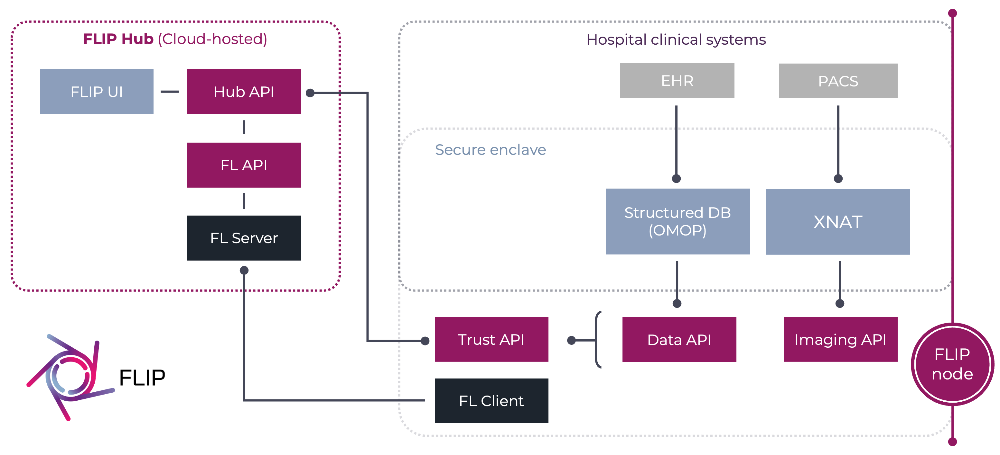
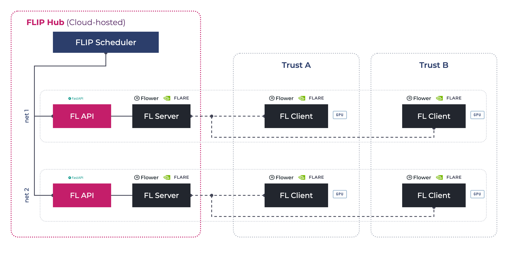

######################
Architecture Overview
######################

************
Architecture
************

The overall FLIP solution comprises three main features:

1. A **Cloud-hosted Central Hub** providing researchers with the capability to define machine learning projects, discover appropriate datasets at participating Trusts and federate the testing and training of relevant models across Trusts, culminating in the aggregation of a consensus model.
2. A **Secure Enclave** hosted on premise at each individual Trust providing a highly secure environment designed to solely permit requests for training from the Central Hub. A set of FLIP microservices are hosted within the Secure Enclave to handle these requests, scheduling and managing workload for the bespoke compute resources.
3. A **high performance compute stack** designed specifically for the rapid testing and training of machine learning models. This consists of a number of powerful GPUs and a cluster of head nodes to receive requests from the FLIP microservices and orchestrate the compute resource.

   FLIP architecture.

Central Hub
============

The Central Hub is a cloud-hosted environment which provides researchers with the capability to identify a cohort and initiate requests to train models in a federated setting. Role based access controls ensure that users will only be able to access their specific data.

Researchers can define the cohort of data they wish to use for training and testing based on data from the available Trusts, view statistics about the available data, tweak and refine their query, and ultimately decide on a dataset on which to train and test their model. Following this, the model is distributed, trained and tested within the Secure Enclave at each selected Trust before the resultant model is centrally aggregated.

Secure Enclave
===============

The Trust component of FLIP runs in a Secure Enclave at each Trust to facilitate the secure training and testing of the models on the high-performance GPU hardware.

As per security principles, no personally identifying data leaves the Secure Enclave.

FLIP implements a microservice-based architecture. The ``imaging-api`` and ``data-access-api`` are deployed as Dockerised microservices, orchestrated by the ``trust-api``.

**********
Components
**********

Docker
======

All client-side services deployed into the Secure Enclave are running as Dockerised components.

OMOP
====

The `OMOP <https://www.ohdsi.org/data-standardization/>`_ Common Data Model describes a common format and representation of data that allows data from different systems that may have hugely different structures of data to be analysed more easily.

A Common Data Model is needed as Trust data sources will have different formats, structures and representations of data depending on their primary need. To allow for research, assessing and analysing data, a common data model is needed.

The OMOP CDM is implemented as a PostgreSQL database in the Data Centre at each Trust.

XNAT
====

The primary functionality of :term:`XNAT` is to provide a place to store and control access to imaging data such as DICOM series images. This includes user control, search and retrieval and archiving capabilities.

XNAT enables quality control procedures and provides secure access to storage of data.

XNAT includes a pipeline engine to allow complex workflows with multiple levels of automation. This can include things such as converting DICOM to NIfTI file formats.

FL nets
=======

The Federated Learning functionality is provided by either :term:`NVIDIA FLARE` or :term:`Flower Framework`.

The FL services are deployed in a collection of 'nets' or 'federations', with a net consisting of a central API and server with a client at each of the Trusts.

Each net will have access to GPU resource at each of the Trusts to perform the model training.

FLIP jobs are distributed by the central hub FL scheduler to an available net.

   FL nets and scheduler.
