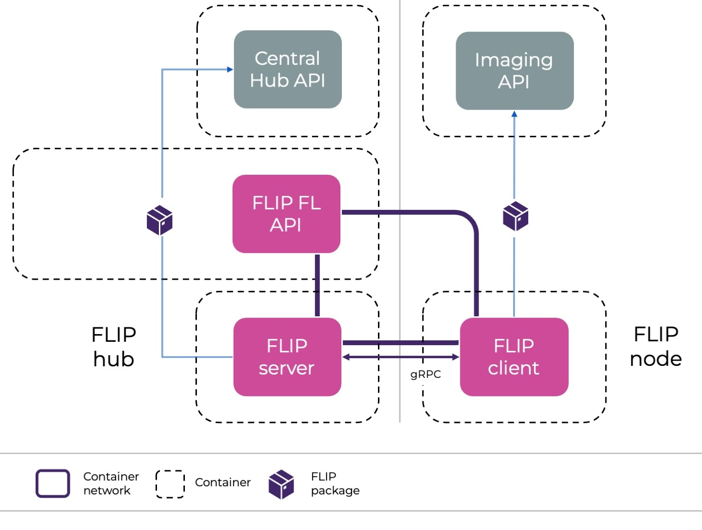
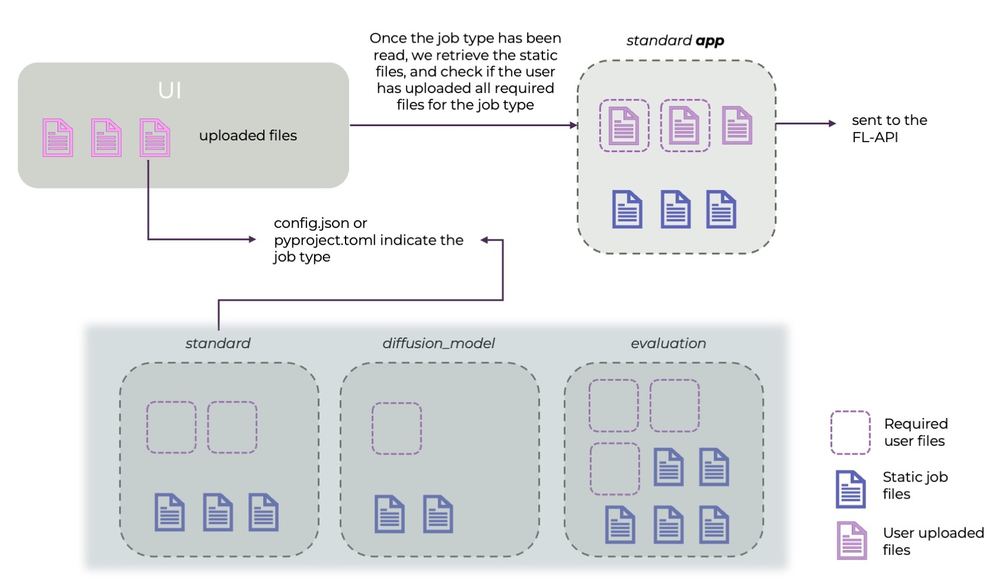

.. _flip-fl-nodes:

#########################
Federated Learning Nodes
#########################

FLIP supports two federated learning frameworks: NVFLARE and Flower AI. 
In both settings, the minimum components are:

- FL server: orchestrates the training process across sites and performs the aggregation of weights. It also uploads results at the end of the training.
- FL client: performs local training on the data at each site and sends the weights to the server.
- FL API: launches the training and acts as interface between the other FL components and the Central Hub API.

The FL API and Server are hosted at the Central Hub (in the Cloud), while client nodes are launched in the sites participating in a specific project (Cloud or on-premise).

   
   Depiction of the FL nodes and the services they communicate with.

Only the client will be running deep learning training, and therefore, requires access to GPU units.

Job types 
------------------------

Due to security restrictions, FLIP users are not allowed to control what happens on the server side.
Although most adjustable aspects of machine learning training happen on the client side 
(e.g. dataloading, training loop, model architecture), FLIP provides different job types
that the user can choose based on their needs.
Currently, these job types include federated averaging (job type `standard`),
evaluation task (job type `evaluation`), federated optimisation (job type `fed_opt`)
and diffusion model training (job type `diffusion_model`), which covers multi-stage federated training.
For NVFLARE, two further job types drive the client code through the modern **NVFLARE Client API**
(a plain training/evaluation script using ``nvflare.client`` instead of a class-based ``Executor``):
federated averaging (job type `standard_client_api`) and model evaluation (job type `evaluation_client_api`).
More job types will be added in the future, adjusting to the community's needs.

**How to choose a job type?**

A federated learning job is an ensemble of files (among which we can find `python`, `json` or `toml` files)
we call an app. Some of these files are required to run the app (for instance, the `pyproject.toml` file in a Flower app),
and some are optional. 

The job type is passed as key `job_type` in the `config.json` file (for both NVFLARE and Flower apps).

Once uploaded, the UI will indicate which files are required for the specific job. 

Then, the Central Hub API will take care of bundling together:
- The files the user has uploaded
- The static (non-modifiable) files that are required for the specific job type.

For more information about currently supported apps, see the per-job-type implementations under
`fl-apps/ <https://github.com/londonaicentre/FLIP/tree/develop/fl-apps/nvflare>`_ (``standard``, ``evaluation``,
``diffusion_model``, ``fed_opt``, ``standard_client_api``, ``evaluation_client_api``).

Examples of how the same job type (standard -> federated averaging) can run different user-uploaded applications are:

- `xray_classification <https://github.com/londonaicentre/FLIP/tree/develop/fl-tutorials/nvflare/image_classification/xray_classification>`_
- `3d_spleen_segmentation <https://github.com/londonaicentre/FLIP/tree/develop/fl-tutorials/nvflare/image_segmentation/3d_spleen_segmentation>`_

Both cases perform a supervised federated averaging training, but the data, architecture and training configuration are different.

The NVFLARE Client API job types have their own tutorials:

- `xray_classification_client_api <https://github.com/londonaicentre/FLIP/tree/develop/fl-tutorials/nvflare/image_classification/xray_classification_client_api>`_ (job type `standard_client_api`)
- `3d_spleen_segmentation_evaluation_client_api <https://github.com/londonaicentre/FLIP/tree/develop/fl-tutorials/nvflare/image_evaluation/3d_spleen_segmentation_evaluation_client_api>`_ (job type `evaluation_client_api`)

These tutorials run on the local NVFLARE simulator from the repo root — e.g.
``make -C fl-tutorials run-tutorial TUTORIAL=xray_classification`` (requires a GPU and the
``flare-fl-base`` image; see the
`fl-tutorials/ <https://github.com/londonaicentre/FLIP/tree/develop/fl-tutorials/nvflare>`_ README).

   
   Workflow of how the user uploads files for a specific job type.

Data access and communication with external services
----------------------------------------------------

Though the user is allowed to upload the training script that will run on the client side, the access to data will have
to be via the FLIP package (see `https://github.com/londonaicentre/FLIP/tree/develop/flip-utils/flip`).
This package, installed by default in client and server nodes, will make a series of functions available to the user. 

For data access:
- `flip.get_dataframe(project_id, query)`: retrieves the dataframe linked to the project ID and query that have been used on the project.
- `flip.get_by_accession_number(project_id, accession_id, resource_type)`: retrieves data of a certain type (e.g. NIFTI) associated with an accession ID. ``resource_type`` defaults to ``ResourceType.NIFTI`` and can be a single type or a list.

These calls - among others - communicate with the Imaging API and retrieve the data from the project's XNAT.

For communication with the Central Hub:
- `flip.update_status(model_id, new_model_status)`: these calls will update the Central Hub about status on the specific model that is running (example: when it started training, or if there's an error).
- `flip.send_metrics(client_name, model_id, label, value, round)`: sends a metric to the central hub so that it can plot the training results
- `flip.send_event(model_id, event_type, global_round, ...)`: sends a typed round-progress **fact** to the Central Hub — one of ``ROUND_STARTED``, ``CLIENT_RESULT_RECEIVED`` (with the serialized update size in ``details.size_bytes``) or ``ROUND_AGGREGATED`` (with ``returned``/``expected`` counts). The hub composes the display text shown in the model page's Live activity feed at serve time, so wording changes ship with a flip-api redeploy and never require rebuilding FL images. Rounds are 1-based on both backends.

The fl-server emits these events automatically — NVFLARE via the FLIP ``ScatterAndGather``/``ServerEventHandler`` components (wired by path in each template's server config, so no app-template changes were required), Flower via the ``flip.flower.strategy.FlipFedAvg`` base strategy the app templates subclass. User training code never calls ``send_event`` directly. Pre-existing **Flower** apps (whose uploaded strategy subclasses stock ``FedAvg``) keep working and simply emit no round telemetry; pre-existing **NVFLARE** apps reference the FLIP components by path from the baked ``flip`` package, so they start emitting as soon as the fl-server image carries this version — with no app change.

Note the reported upload sizes measure slightly different things per backend — NVFLARE sums the in-memory tensor sizes of the client's (possibly partial) weight update, Flower sums the serialized array buffers — each internally consistent within a run.

The server will also use the package to update the status, as well as to upload the final results, which will be first saved in the server, to the final S3 buckets users can download from.

Privacy filters on shared model updates
---------------------------------------

Before a client's training result leaves a site, the NVFLARE training job types (`standard`, `fed_opt`,
`diffusion_model`, `standard_client_api`) pass it through a percentile-based privacy filter
(``PercentilePrivacy``, following Shokri & Shmatikov, "Privacy-preserving deep learning", CCS '15):

- weight-diff components with magnitude **below** the ``percentile``-th percentile are zeroed, so only the
  largest ``100 - percentile`` % of each update's components are shared;
- the surviving components are truncated to ``±gamma``.

FLIP ships the stock NVFLARE defaults — ``percentile=10``, ``gamma=0.01`` (share the top 90 %, clip at 0.01).
Both values can be tuned per app in the job's ``config_fed_client.json`` (or via
``FlipFedAvgRecipe(percentile_privacy=...)`` for recipe-generated jobs), and the filter can be disabled for a
run with ``off: true``. Two caveats for anyone changing them:

- **Raising** ``percentile`` **sharply degrades training.** At e.g. 95 only the top 5 % of every update
  survives, which stalls FedAvg convergence; on a frozen-backbone (head-only) finetune it silently resets the
  global head every round. For that reason the head-only ``KeepOnlyVars`` filter is always ordered before
  ``PercentilePrivacy``, so the percentile is computed over the trainable parameters only, never the frozen
  backbone's all-zero diffs.
- **This is a heuristic output filter, not formal differential privacy.** Sparsifying and clipping each shared
  update bounds what a single round reveals, but adds no calibrated noise and carries no
  ``(epsilon, delta)`` guarantee. It complements — rather than replaces — FLIP's primary output controls
  (review of the uploaded app code and aggregate-only results).

Disclaimer: some things are still under construction!
-----------------------------------------------------

There are currently some elements that are still under construction, and might not adjust exactly to 
the description above:

- for the Flower framework, users have to upload the `server_app.py` in addition to the `client_app.py` and additional auxiliary code, but in the future, this will not be the case.
- for the class-based NVFLARE job types (`standard`, `evaluation`, `fed_opt`, `diffusion_model`) the user upload is intentionally minimal — `trainer.py` / `validator.py` / `models.py` / `config.json` — and the rest of the app is filled in from
  the static (non-modifiable) templates baked into the flip-api image at `FL_APP_BASE_DIR` (`fl-apps/`, see FLIP#724).
  These templates used to be published to an S3 bucket; that path has been removed. You can check what a fully bundled app looks like by consulting
  the per-job-type implementations under `fl-apps/ <https://github.com/londonaicentre/FLIP/tree/develop/fl-apps/nvflare>`_.
- the modern NVFLARE Client API job types (`standard_client_api`, `evaluation_client_api`) instead let the user upload a plain training/evaluation script that calls
  ``nvflare.client`` directly. Over time, more job types will migrate to this recipe-driven model.

