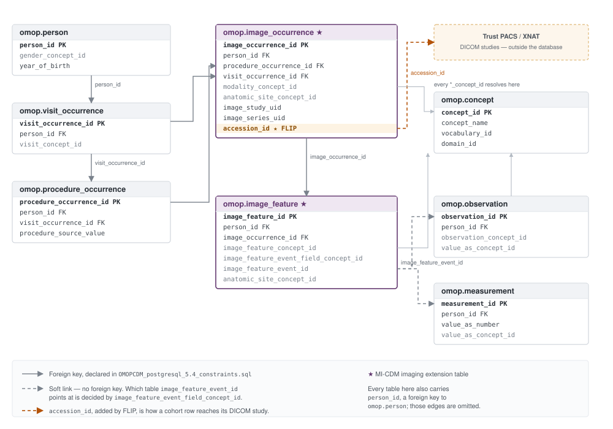

.. _flip-omop:

#############
OMOP Database
#############

FLIP requires data from all participating Trusts to be stored in a standardised format so that a single query can be federated between the sites to generate a cohort of data. Aggregate statistics are returned as results on the platform and, if and when the project is approved, the underlying data at each site will be retrieved and provided for local model training.

The `Observational Health Data Sciences and Informatics (OHDSI) <https://www.ohdsi.org/>`_ `Observational Medical Outcomes Partnership (OMOP) Common Data Model (CDM) <https://www.ohdsi.org/data-standardization/>`_ has been selected as the format for standardised data storage, so the database in each Trust's local instance FLIP is commonly referred to as the *OMOP Database* or *OMOP*.

To prepare the standardised data to be ingested into each Trust's OMOP Database, resources are provided during the onboarding stage.

.. contents:: On this page
   :local:
   :depth: 2

.. _omop-schema:

******
Schema
******

The database implements `OMOP CDM 5.4 <https://ohdsi.github.io/CommonDataModel/cdm54.html>`_ in the
``omop`` schema — all 39 standard tables — extended with the two
:ref:`MI-CDM imaging tables <omop-micdm>`. The DDL lives in the repository at
``trust/omop-db/files/OMOPCDM_postgresql_5.4_ddl.sql``, derived from the OHDSI
`CommonDataModel <https://github.com/OHDSI/CommonDataModel>`_ project's
``inst/ddl/5.4/postgresql`` and extended in place.

Most of those 41 tables are unused by FLIP. The diagram below shows the part a cohort query can
draw on: the clinical context on the left, the imaging metadata in the middle, the values and the
vocabulary on the right.

      on, showing person, visit_occurrence and procedure_occurrence linked to the MI-CDM tables
      image_occurrence and image_feature, which reach observation and measurement through a soft
      link and resolve concept ids through the concept table; image_occurrence.accession_id points
      out of the database at the Trust PACS and XNAT.
   :align: center

   The FLIP-relevant subset of OMOP CDM 5.4. Purple tables are the MI-CDM imaging extension;
   ``accession_id`` is a FLIP addition to it.

.. _omop-micdm:

The MI-CDM imaging extension
============================

Standard OMOP has nowhere to record an imaging study. The
`Medical Imaging Common Data Model (MI-CDM) <https://www.ncbi.nlm.nih.gov/pmc/articles/PMC11031512/>`_
is the OHDSI extension that adds one — the successor to the earlier R-CDM radiology tables — and
FLIP implements it with two tables.

``image_occurrence`` holds one row per imaging study or series — FLIP populates one row per
accession:

.. list-table::
   :widths: 34 22 44
   :header-rows: 1

   * - Column
     - Type
     - Meaning
   * - ``image_occurrence_id``
     - ``serial``
     - Primary key.
   * - ``person_id``
     - ``integer``
     - The patient. Foreign key to ``person``.
   * - ``procedure_occurrence_id``
     - ``integer``
     - The procedure that produced the images, e.g. the chest X-ray. Foreign key.
   * - ``visit_occurrence_id``
     - ``integer``
     - The encounter the imaging belongs to. Foreign key.
   * - ``anatomic_site_concept_id``
     - ``integer``
     - Body part imaged, as a concept id.
   * - ``modality_concept_id``
     - ``integer``
     - DICOM modality, as a concept id — e.g. ``4300757`` is *Computed tomography*.
   * - ``image_study_uid`` / ``image_series_uid``
     - ``varchar(64)``
     - DICOM Study and Series Instance UIDs.
   * - ``wadors_uri`` / ``local_path``
     - ``varchar(512)``
     - MI-CDM's own pointers to the pixel data. FLIP resolves images through ``accession_id``
       instead and reads neither at query time, but ``local_path`` is not dead weight: the spleen
       tutorial's enrichment step recovers each study's MSD case name from that column of the
       canonical CSV export.
   * - ``image_occurrence_date``
     - ``date``
     - Study date.
   * - ``accession_id``
     - ``varchar(255)``
     - **FLIP addition.** The PACS accession number for the study.

``image_feature`` holds findings derived from those images — one row per finding, not per study:

.. list-table::
   :widths: 34 22 44
   :header-rows: 1

   * - Column
     - Type
     - Meaning
   * - ``image_feature_id``
     - ``serial``
     - Primary key.
   * - ``person_id`` / ``image_occurrence_id``
     - ``integer``
     - The patient and the study the finding came from. Foreign keys.
   * - ``image_feature_concept_id``
     - ``integer``
     - *Which* finding this row is about, e.g. ``4215818`` *Effusion*.
   * - ``image_feature_event_field_concept_id``
     - ``integer``
     - Which table holds the finding's **value**. ``1147304`` is the concept for ``observation``.
   * - ``image_feature_event_id``
     - ``integer``
     - The row id in that table. Not a foreign key — see below.
   * - ``image_feature_type_concept_id``
     - ``integer``
     - Provenance of the finding, e.g. read from a report versus produced by an algorithm.
   * - ``image_finding_concept_id``
     - ``integer``
     - The kind of finding the row belongs to, e.g. *nodule*, as a concept id.
   * - ``image_finding_id``
     - ``integer``
     - Groups the ``image_feature`` rows describing one finding. Locally minted — there is no
       finding table for it to reference.
   * - ``anatomic_site_concept_id``
     - ``integer``
     - Body part the finding concerns.
   * - ``alg_system`` / ``alg_datetime``
     - ``varchar`` / ``timestamp``
     - The algorithm that produced the finding, and when, where applicable.

There is no ``image_study`` table — the study identifier is the ``image_study_uid`` column.

Three consequences matter when writing a cohort query:

``accession_id`` is how a cohort row reaches its images
   ``image_occurrence.accession_id`` is not part of upstream MI-CDM; FLIP adds it with a bare
   ``ALTER TABLE ... ADD COLUMN`` in the DDL. It is the accession number XNAT uses to pull the study
   out of the Trust PACS, and every cohort query that wants imaging must project it. Omitting it
   fails loudly rather than silently: the Data Access API's accession-id route wraps the saved query
   as ``SELECT accession_id FROM (<query>) AS cohort_subquery``, so the column's absence surfaces as
   an error rather than as a cohort with no imaging attached.

The link from ``image_feature`` to its value is a soft one
   ``image_feature`` does not carry the finding's value. Instead
   ``image_feature_event_field_concept_id`` names the table that does — ``observation`` for the
   tutorial queries, ``measurement`` where the value is numeric — and ``image_feature_event_id``
   gives the row id in it. There is no foreign key to follow and no way to infer the target from the
   schema, so a query has to pin the field concept itself — ``= 1147304`` for ``observation`` — before
   joining. The image tables' ``*_concept_id`` columns sit in the same blind spot: unlike the
   standard tables, neither declares a foreign key to ``concept``, so the constraints describe only
   five of the links a query actually follows.

Concept ids are meaningless until they are joined
   Every ``*_concept_id`` resolves through ``omop.concept``, and the licensed core vocabulary that
   populates it arrives by a separate seeding step, not with the data. Before that step a Trust
   database still has a non-empty ``omop.concept`` — the DICOM vocabulary ships inside the data
   volume — so counting its rows tells you nothing; a join on a SNOMED CT or LOINC id simply matches
   nothing. See :ref:`omop-dev-instance`.

.. _omop-sample-queries:

*********************
Sample cohort queries
*********************

The tutorials in ``fl-tutorials/`` each ship the cohort query they were written against. Two of them
bracket the range of what a query has to do. Both are shown below in full, less the licence
header; the Flower copies
(``fl-tutorials/flower/xray_classification/query.sql`` and
``fl-tutorials/flower/3d_spleen_segmentation/query.sql``) are byte-identical, so cohort queries are
independent of the FL backend.

Chest X-ray classification — labels out of OMOP
===============================================

.. literalinclude:: ../../../fl-tutorials/nvflare/image_classification/xray_classification/query.sql
   :language: sql
   :start-after: -- limitations under the License.
   :caption: ``fl-tutorials/nvflare/image_classification/xray_classification/query.sql``

This is the general shape of a supervised imaging query, in three steps:

#. ``feature_observation`` narrows ``image_feature`` to the rows whose value lives in
   ``observation`` (``image_feature_event_field_concept_id = 1147304``), which is what makes
   ``image_feature_event_id`` safe to join on.
#. ``observation_value`` **pivots**. ``image_feature`` has one row per finding, so a study with three
   findings is three rows; the ``MAX(CASE WHEN image_feature_concept_id = ... THEN ... END)``
   idiom collapses them into one row per study with one column per finding. The concept ids
   in this tutorial are ``4215818`` *Effusion*, ``4196943`` *Edema* and ``40481136``
   *Lungs in normal arrangement*. The join to ``omop.concept`` that decodes each Yes/No answer
   (``value_concept``) lives inside this CTE — it is the one an unseeded vocabulary breaks first.
#. The outer ``SELECT`` joins ``omop.concept`` again to turn modality and anatomy ids into names,
   and aliases each pivoted column.

Those aliases are load-bearing. The dataframe the FL client receives from ``flip.get_dataframe`` has
exactly the query's output column names, and the tutorial matches them by **exact string** — the
``LESIONS`` map in its ``config.json`` contains ``"Effusion"``, ``"Edema"`` and
``"Lungs in normal arrangement"``, which is why the SQL quotes those aliases verbatim.

Rename a *lesion* column in the query without renaming it in ``config.json`` and training dies with
a ``KeyError`` on that lesion — loud, but a long way from the SQL that caused it. Rename the
*normality* column and nothing raises at all: the negative override simply stops firing, and every
study silently keeps its per-lesion values. That one is the trap.

3D spleen segmentation — labels not in OMOP
===========================================

.. literalinclude:: ../../../fl-tutorials/nvflare/image_segmentation/3d_spleen_segmentation/query.sql
   :language: sql
   :start-after: -- limitations under the License.
   :caption: ``fl-tutorials/nvflare/image_segmentation/3d_spleen_segmentation/query.sql``

Four lines, because there is nothing to pivot. A segmentation mask is a 3D volume, and OMOP has no
column shaped like one, so the query's whole job is to name the studies —
``modality_concept_id = 4300757`` is *Computed tomography* — and let ``SELECT *`` carry
``accession_id`` through. The masks reach the model by a separate route: they are uploaded into XNAT
alongside the converted images during :doc:`data enrichment </user-guides/user-data-enrichment>`.

This is the practical test for a new app. If the label already exists in OMOP, project it as a column
and no enrichment is needed. If it does not — anything spatial or image-derived — the query only
selects the cohort, and the labels are enriched into XNAT.

.. note::

   A cohort query must be a single ``SELECT``-shaped statement, no larger than 10 KiB, with every
   table in the ``omop`` schema and literal integer ``LIMIT``/``OFFSET`` values. The Trust-side
   ``validate_query`` in ``trust/data-access-api/data_access_api/services/cohort.py`` is the
   authority on this — it parses the query, checks the syntax tree and re-emits the SQL that actually
   runs. See :ref:`create-cohort-query` for the user-facing workflow.

**************
Access control
**************

On Compose deployments, cohort queries issued by the Data Access API connect as
``DATA_ACCESS_POSTGRES_USER`` — ``data_analyst_reader`` by default — a member of
``omop_readonly_base``. The grants are created at first initialisation by
``trust/omop-db/files/create_readonly_users.sql``: ``CONNECT`` on the database, ``USAGE`` on the
``omop`` schema and ``SELECT`` on its tables and sequences, with ``INSERT``, ``UPDATE``, ``DELETE``,
``TRUNCATE`` and ``CREATE`` explicitly revoked, a five-connection limit and a 300-second
``statement_timeout``. This is the database half of the Data Access API's SQL validation
defence-in-depth.

.. note::

   None of that applies on Kubernetes. The Trust chart creates the role directly with ``CONNECT``
   and ``pg_read_all_data`` — no base-role membership, no connection limit, no statement timeout and
   no revokes — so a Kubernetes Trust has neither the 300-second cap nor a schema-scoped grant, and
   the schema pin inside ``validate_query`` is what keeps a query inside ``omop``. Narrowing the
   grant to match Compose is tracked in
   `FLIP#904 <https://github.com/londonaicentre/FLIP/issues/904>`_.

Row-level results are additionally gated on the Trust's ``COHORT_QUERY_THRESHOLD`` (default 10): a
cohort smaller than the threshold is refused with a fixed message, identical to the one a cohort of
zero produces, so the refusal itself discloses nothing. The threshold is evaluated against the live
cohort on every call rather than frozen at approval. :doc:`/security` covers the full set of controls
around the clinical data boundary.

.. _omop-dev-instance:

*******************************
Mocked instance for development
*******************************

Development and staging Trust stacks run a mocked OMOP database:
``ghcr.io/londonaicentre/omop-db``, a PostgreSQL image whose build source lives
in-repo at ``trust/omop-db/`` (schema init chain, read-only roles, vocabulary
load). Its synthetic cohort rows are maintained as a single canonical CSV
dataset on the public Hugging Face dataset
`aicentreflip/trust-data <https://huggingface.co/datasets/aicentreflip/trust-data>`_,
deterministically split across however many mock Trusts are stood up.

Getting the data
================

Dev stacks do not build the database — they download a ready-populated PostgreSQL data volume per
Trust from the same public dataset, roughly 11 MB each, at
``https://huggingface.co/datasets/aicentreflip/trust-data/resolve/<version>/trust<N>/trust<N>_pgdata.tar``
(gzip-compressed despite the ``.tar`` name). There is one copy of each archive; a data version is a
git tag on the dataset, pinned by ``trust/.data_version`` (one pin for OMOP and Orthanc together), and
the download is anonymous — no AWS credentials. Bringing a Trust up syncs it automatically; to do it
by hand:

.. code-block:: bash

   make -C trust update-omop-data            # both dev Trusts
   make -C trust update-omop-data TRUST=1    # Trust_1 (GSTT) only

The canonical CSVs behind those volumes live under ``omop-csv/<project>/`` in the same dataset, at
the same tag. Every
row carries a ``source_trust`` column, and standing up N Trusts is a deterministic split of that one
dataset — see ``trust/omop-db/README.md`` for the partition modes and for rebuilding the volumes.

Seeding the vocabulary
======================

The published image and the data volumes are deliberately **vocabulary-free**. SNOMED CT, LOINC,
Read v2 and dm+d are licensed material, so they are kept out of every published artifact and each
environment loads the bundle it is licensed to use into its own running database, once:

.. code-block:: bash

   make -C trust/omop-db load-omop-vocab                    # Trust_1 (GSTT, port 5434)
   make -C trust/omop-db load-omop-vocab OMOP_DB_PORT=5436  # Trust_2 (KCH)

.. warning::

   Until this has run, **a cohort query that resolves core-vocabulary concepts returns nothing** —
   the chest X-ray query above among them, because the SNOMED CT ids it joins on are not there. The
   stack starts cleanly and the result looks like an empty cohort. Don't diagnose it by counting
   ``omop.concept``: the DICOM vocabulary ships in the data volume, so that table has rows either
   way. ``omop.concept_ancestor`` is the empty one, and it is what the Data Access API probes — a
   genuinely empty cohort makes it log an error naming this exact cause and the command to fix it.

   The spleen query is the exception: it filters on a concept id but never joins ``omop.concept``,
   so it keeps working on an unseeded stack.

Two ways to obtain the bundle: FLIP developers with organisation AWS access run
``make -C trust/omop-db fetch-vocab-core``; anyone else can build an equivalent export from
`OHDSI Athena <https://athena.ohdsi.org/>`_ under their own licences and unpack it into
``trust/omop-db/data/vocab_aicentre_core_20240916/``. Do that first — ``load-omop-vocab`` depends on
``fetch-vocab-core``, which skips the download when the directory is already there but fails without
AWS access when it is not. The DICOM vocabulary is
separate — it is freely redistributable, ships inside the data volumes, and needs no seeding step.
``trust/omop-db/README.md`` carries the full vocabulary roster, versions and licensing.
