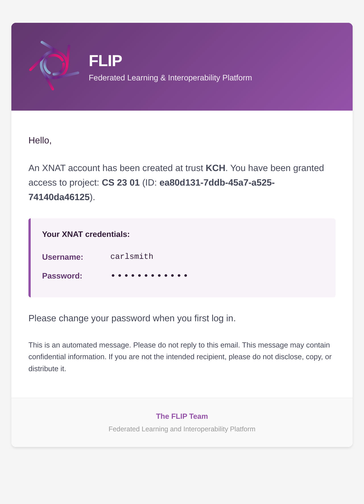
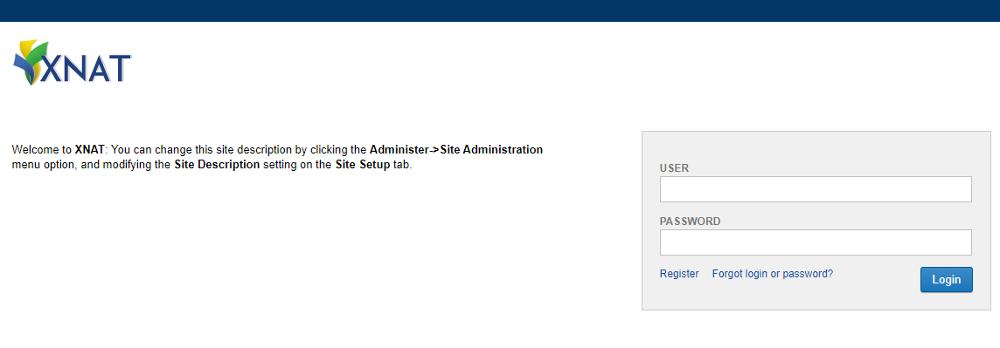

.. _flip-xnat:

####
XNAT
####

This page provides a quick-reference guide to both interactions with the XNAT UI which may be required in preparation for model training, and programmatic XNAT interactions which are made available during model training i.e. downloading imaging data.

`XNAT <https://www.xnat.org/>`_ is an open-source imaging informatics software platform dedicated to imaging-based research. XNAT's core functions manage importing, archiving, processing and securely distributing imaging and related study data. Detailed documentation on how to use XNAT is `provided on their wiki <https://wiki.xnat.org/documentation/how-to-use-xnat>`_.

Upon FLIP project approval, XNAT project creation tasks are queued for each trust. Trusts poll for these tasks and create the XNAT projects locally. Relevant imaging data is then imported from trust PACS systems. Model developers are granted access to the XNAT project at each trust in order to perform any data preparation and enrichment activities which may be necessary for the running & training of AI models.

*******
XNAT UI
*******

.. _receiving-xnat-credentials:

Receiving XNAT Account Credentials
==================================

On approval of a FLIP project, any associated users will be granted access to the respective XNAT project at each trust. New XNAT user accounts will be generated as necessary. The email address associated with the FLIP user account will be sent details of their XNAT account credentials pertaining to each participating trust.

    Email sent with XNAT account credentials (password masked).

Access
======

XNAT instances are local to each participating trust. As such, model developers are required to access the local network at each Trust in order to access the XNAT web UI and perform any data enrichment activities.

Login
======

Navigate to the XNAT URL. The landing page should appear as follows:

    XNAT login page.

Enter the username and password per the :ref:`receiving-xnat-credentials` section and select 'Login'.

On login, the browser will be directed to the homepage, which lists existing projects and offers a project search capability:

.. figure:: ../assets/xnat/XNAT_home.png
    :width: 600
    :align: center

    XNAT homepage once logged in.

XNAT Project Structure and Navigation
=====================================

XNAT projects exist in the following structure:

.. list-table::
   :widths: 10 30
   :header-rows: 1

   * - Object
     - Object
   * - Project
     - Generated at FLIP Project approval
   * - Subject
     - Represents an individual. Anonymised ID is randomly generated on import
   * - Experiment
     - CT Session labelled with AccessionId
   * - Scan
     - A collection / series of imaging data
   * - Resource
     - Individual imaging data file e.g. DICOM, NIFTI

See `Understanding the XNAT Data Model <https://wiki.xnat.org/documentation/how-to-use-xnat/understanding-the-xnat-data-model>`_ for more information.

Project
^^^^^^^

XNAT projects generated by FLIP are identifiable by a Title which is derived from their FLIP counterpart i.e., **`[FLIP Project Name]`:`[FLIP Project ID]`-FL-Project**.

For example, **Ischemic Stroke Vessel Occlusion:2fd45bc9-861b-4467-9b78-813372a10682-FL-Project**.

To navigate to a project, select a project from the project list or search for a project via the home page.

.. figure:: ../assets/xnat/XNAT_project.png
    :width: 600
    :align: center

    An XNAT project.

The project page displays a list of contained subjects and permits various functions available from the right hand side 'Actions' menu.

Subject
^^^^^^^

Navigate to a subject by selecting it from a project's subject list.

.. figure:: ../assets/xnat/XNAT_subject.png
    :width: 600
    :align: center

    A specific subject.

The subject page displays a list of contained experiments (CT Sessions) and permits various functions available from the right hand side 'Actions' menu.

CT Session
^^^^^^^^^^

Navigate to a CT session by selecting it from a subject's list of experiments.

.. figure:: ../assets/xnat/XNAT_ct_session.png
    :width: 600
    :align: center

    A specific CT session.

A CT session is derived from an imported PACS DICOM Study. The CT session page contains a list of scans in which imaging study data is contained. This includes imported DICOM images and the respective NIFTI files which have also been made available.

Downloading and Uploading Imaging Data
=======================================

Imaging data will be automatically imported from trust PACS systems on XNAT project generation. Model developers may wish to download this data or upload new or amended imaging data to support model development.

Information on how to download and upload imaging data the XNAT UI can be found `here <https://wiki.xnat.org/documentation/how-to-use-xnat#HowToUseXNAT-UploadingImageDatatoXNAT>`_.

****************************
Connecting to a Trust PACS
****************************

XNAT retrieves imaging from the trust's PACS on demand, for the studies belonging to an approved
project cohort. This section describes what has to be configured, and what the trust's PACS and
network teams need to provide.

DICOM Networking in Brief
=========================

Three ideas are enough to follow the rest of this section.

**AE Title.** A DICOM system's *name* on the network — like a hostname, but specific to DICOM, and
at most 16 characters. When one system connects to another it announces "I am *X*, calling *Y*". The
receiver checks that *Y* is its own name and that *X* is one it has been told to accept. Names are
separate from addresses: the IP and port are configured alongside the AE title, not derived from it.

**SCU and SCP.** Client and server. An SCU (Service Class *User*) opens connections; an SCP (Service
Class *Provider*) listens for them. XNAT is both, at different moments — an SCU when it queries the
PACS, an SCP when it receives the images.

**The four operations**, in the order FLIP uses them:

.. list-table::
   :widths: 15 55 30
   :header-rows: 1

   * - Operation
     - What it does
     - Direction
   * - ``C-ECHO``
     - A DICOM ping. Confirms two systems can reach and accept each other
     - either way, for testing
   * - ``C-FIND``
     - Search — "which study has accession number ABC123?"
     - XNAT to PACS
   * - ``C-MOVE``
     - "Send that study to the system called ``FLIPXNAT``"
     - XNAT to PACS
   * - ``C-STORE``
     - The image transfer itself
     - **PACS to XNAT**

.. important::

   C-MOVE does not return the images on the connection that asked for them. XNAT names a
   destination, the PACS looks that name up in its *own* table to find an address, and opens a
   **new connection in the opposite direction** to deliver the study.

   Three consequences follow, and each has caused a failed integration in practice:

   * The destination must be registered on the PACS in advance — a name it does not know cannot be
     delivered to.
   * The AE title and port XNAT advertises must match that registration exactly. XNAT rejects an
     association addressed to a different name, and the DQR plugin refuses to issue a C-MOVE whose
     destination does not correspond to one of its own configured receivers.
   * The return connection needs its own firewall rule. Every other FLIP connection is outbound, so
     this is the one reviewers overlook.

How Retrieval Works
===================

FLIP **pulls**; the PACS is never configured to push into XNAT. XNAT's
`DICOM Query-Retrieve (DQR) plugin <https://wiki.xnat.org/xnat-tools/dicom-query-retrieve-plugin>`_
performs the retrieval, driven over REST by the imaging API:

1. The cohort query is re-run against the trust's OMOP database and returns **accession numbers
   only**.
2. For each accession number, XNAT issues a **C-FIND** to the PACS at STUDY level, matching on
   Accession Number ``(0008,0050)``, to resolve the Study Instance UID.
3. XNAT issues a **C-MOVE** to the PACS, naming itself as the move destination.
4. The PACS **C-STOREs** the study back to XNAT's DICOM SCP receiver, where the site-wide
   anonymisation script runs on receipt, before the session is archived.

Only accession numbers belonging to an approved project cohort are ever requested. There is no
standing forward rule and no bulk transfer.

.. important::

   Step 4 is a connection **from the PACS to XNAT**. It is easy to overlook when specifying firewall
   rules, because every other FLIP connection is outbound. Without it, queries succeed and
   retrievals silently time out.

What the PACS Team Must Register
================================

The FLIP XNAT instance must be registered on the PACS as a DICOM node, permitted to:

* issue **C-FIND** (Study Root query/retrieve) as an SCU;
* act as a **C-MOVE destination**, so retrieved studies can be returned to it;
* issue and answer **C-ECHO**, for verification in both directions.

The trust must supply, and FLIP must be configured with, the PACS AE title, host and query/retrieve
port. FLIP in turn supplies its own AE title, host and DICOM port.

.. note::

   The AE title FLIP presents is one of many configured on a trust PACS, so it should identify the
   platform — for example ``FLIPXNAT``. It must match on both sides: the PACS opens the C-STORE
   association using the AE title it has registered, and XNAT's SCP receiver rejects an association
   addressed to a different AE title.

Configuration
=============

.. list-table::
   :widths: 30 45 25
   :header-rows: 1

   * - Setting
     - Description
     - Default
   * - ``XNAT_AETITLE``
     - XNAT's own AE title, used for the DICOM SCP receiver, the DQR calling AE, and the C-MOVE
       destination
     - ``XNAT``
   * - ``XNAT_PORT``
     - DICOM SCP receiver port
     - ``8104``
   * - ``PACS_AETITLE``
     - AE title of the trust PACS
     - ``ORTHANC``
   * - ``PACS_HOST``
     - Hostname or IP of the trust PACS
     - ``orthanc``
   * - ``PACS_QR_PORT``
     - Query/retrieve port on the trust PACS. Must be reachable *from the XNAT container* — this is
       not a host-published port
     - ``4242``
   * - ``XNAT_WEB_PORT``
     - Host-published port for XNAT's web UI and REST API. Unrelated to DICOM; separate from
       ``XNAT_PORT`` so the DICOM receiver can be published independently. Defaults to ``XNAT_PORT``
     - ``XNAT_PORT``
   * - ``PACS_AVAILABILITY_DAYS`` / ``_START`` / ``_END``
     - When retrieval may run, as a comma-separated day list and a daily window
     - all week, ``00:00``–``24:00``
   * - ``PACS_THREADS`` / ``PACS_UTILIZATION_PERCENT``
     - How hard to drive the PACS during that window
     - ``1`` / ``100``
   * - ``DQR_MAX_PACS_REQUEST_ATTEMPTS`` / ``DQR_RETRY_WAIT_SECONDS``
     - How many times, and how far apart, to retry a study the PACS did not deliver
     - ``100`` / ``300``

The defaults describe the mocked PACS that ships with FLIP for development, described below.

Development: the Mocked PACS
============================

FLIP ships an `Orthanc <https://orthanc.uclouvain.be/>`_ DICOM server that stands in for the trust
PACS during development and testing. It is seeded with synthetic DICOM studies whose accession
numbers match the mocked OMOP database, so a cohort query resolves to real studies and the full
retrieval path can be exercised without a hospital PACS.

Orthanc is a genuine DICOM node, so it answers C-FIND and C-MOVE exactly as a production PACS would
and returns studies by C-STORE. The retrieval path under test is therefore the same one used against
a trust PACS — only the peer differs. It is why the configuration defaults above name ``orthanc``:

* ``PACS_HOST=orthanc`` — the container name on the FLIP network
* ``PACS_AETITLE=ORTHANC`` — Orthanc's AE title
* ``PACS_QR_PORT=4242`` — Orthanc's DICOM port

Because both sit on the same container network, Orthanc reaches XNAT's SCP receiver directly and no
host port needs publishing. A real PACS is outside that network, which is the one material
difference between the two setups and the reason the receiver must be explicitly exposed.

.. note::

   The mocked PACS is for development and testing only. In a trust deployment the imaging comes from
   the trust's own PACS, and Orthanc is either absent or confined to the FLIP node — its DICOM port
   is deliberately not published to the wider network.

.. warning::

   The DICOM port must be **the same number everywhere** — the port XNAT binds, the port recorded on
   its SCP receiver, the port advertised as the C-MOVE destination, and the port the PACS connects
   to. DQR matches the C-MOVE destination against a registered SCP receiver by exact AE title and
   port, so any translation between these layers causes retrieval to fail.

Example: Sectra PACS
====================

The values below illustrate the shape of the exchange with a Sectra PACS. **They are examples, not
defaults** — each trust supplies its own.

Provided by the trust's PACS team:

.. code-block:: text

   Query/Retrieve node (PACS)
     AE Title:  QR_SCP_EXAMPLE
     IP:        10.0.0.10
     Port:      8059

Provided by FLIP, to be registered on the PACS as a destination:

.. code-block:: text

   Destination node (FLIP XNAT SCP receiver)
     AE Title:  FLIPXNAT
     IP:        10.0.0.20
     Port:      8104

Firewall rules required, in both directions:

.. list-table::
   :widths: 40 20 40
   :header-rows: 1

   * - Connection
     - Direction
     - Purpose
   * - XNAT host → PACS query/retrieve port
     - Outbound
     - C-ECHO, C-FIND, C-MOVE requests
   * - PACS → XNAT host DICOM port
     - **Inbound**
     - C-STORE of the retrieved studies

.. important::

   Where the PACS is vendor-managed, opening the trust's own firewall may not be sufficient. The
   vendor may operate a separate firewall that must also whitelist the connection, raised through
   the trust's service desk as a request to the PACS supplier.

Scheduling and Throughput
=========================

A production PACS may limit how much can be retrieved before it refuses further connections, and
bulk retrieval competes with clinical use. Agree a retrieval schedule with the trust's PACS manager,
then configure XNAT to match: the DQR settings control retry behaviour, and each registered PACS
carries an availability schedule with a per-day window, a thread count and a utilisation percentage.

Where a trust has a test or pre-production PACS, connecting FLIP to that first is recommended, and
is usually raised as a separate service request.

.. note::

   The availability schedule is applied when the PACS is first registered. The DQR plugin pre-creates
   the intervals, and rejects a later write to a day that already has one, so changing the window on
   an already-configured instance requires deleting the existing intervals through XNAT's
   administration UI first. The values above therefore take effect on a fresh deployment; on a
   running one, check what is actually configured rather than assuming the setting was applied.

Verification
============

Work outwards from the network layer:

1. **C-ECHO in both directions** — from the PACS to the FLIP XNAT AE title and port, and from XNAT
   to the PACS. This confirms both firewall directions before any DICOM data moves.
2. **Ping the PACS from XNAT** — ``GET /xapi/pacs/{id}/status`` should report the PACS as reachable
   and enabled.
3. **Query a single accession number** — ``POST /xapi/dqr/query/studies`` should return the matching
   study.
4. **Import a single study**, and confirm it archives into the expected project with anonymisation
   applied.
5. **Run a full project import**, monitoring the import status counts.

.. note::

   XNAT must be restarted for changes to its DICOM configuration to take effect. XNAT also holds the
   DICOM port while running, so command-line testing with a tool such as ``storescp`` on the same
   port requires stopping XNAT first.

****************************
DICOM Anonymization
****************************

XNAT includes a built-in anonymization engine that processes incoming DICOM data to remove Protected Health Information (PHI) from DICOM headers. The anonymization script is applied site-wide to all data received via the SCP receiver.

Default Anonymization Script
============================

XNAT ships with a minimal default anonymization script that can be retrieved via the API:

.. code-block:: bash

    curl -X GET "http://<xnat-host>/xapi/anonymize/default" -H "accept: text/plain"

The default script performs only basic label mapping:

.. code-block:: text

    //
    // Default XNAT anonymization script
    // XNAT http://www.xnat.org
    // Copyright (c) 2005-2017, Washington University School of Medicine
    // and Howard Hughes Medical Institute
    // All Rights Reserved
    //
    // Released under the Simplified BSD.
    //
    version "6.1"
    project != "Unassigned" ? (0008,1030) := project
    (0010,0010) := subject
    (0010,0020) := session

FLIP Anonymization Script
=========================

FLIP replaces the default script with a comprehensive site-wide anonymization script (``anon_script.das``) that provides more thorough PHI removal, including:

- **Patient identifiers**: birth date, address, telephone numbers, other patient IDs
- **Institutional identifiers**: institution name, address, department
- **Physician/operator identifiers**: referring, performing, and requesting physicians
- **Other identifying tags**: accession number, medical record locator, ethnic group, occupation
- **UID pseudonymization**: study and series instance UIDs are hashed for repeatable pseudonymization
- **De-identification recording**: sets ``Patient Identity Removed`` and ``De-identification Method`` tags

The script is configured automatically during XNAT initialization via ``configure-xnat.sh``. It is applied to all incoming DICOM data when the SCP receiver has ``anonymizationEnabled`` set to ``true``.

Anonymize API Endpoints
=======================

The following XNAT anonymize-api endpoints are used by FLIP:

.. list-table::
    :widths: 10 30 30
    :header-rows: 1

    * - Method
      - Endpoint
      - Description
    * - GET
      - ``/xapi/anonymize/default``
      - Gets the default anonymization script
    * - PUT
      - ``/xapi/anonymize/site``
      - Sets the site-wide anonymization script
    * - PUT
      - ``/xapi/anonymize/site/enabled``
      - Enables or disables the site-wide anonymization script

****************************
DICOM to NIfTI Conversion
****************************

XNAT can automatically convert DICOM images to NIfTI format using the ``dcm2niix`` tool via the Container Service plugin. FLIP controls this conversion on a per-project basis through two XNAT mechanisms:

Commands vs Event Subscriptions
================================

XNAT's **Container Service** registers ``dcm2niix`` as a *command*. This command is enabled site-wide, making it available for manual triggering from the XNAT UI in any project via the **Run Containers** action menu.

XNAT's **Event Service** provides *event subscriptions* that automatically trigger commands in response to platform events. FLIP creates **per-project** event subscriptions that listen for ``ScanEvent:CREATED`` events (i.e., when DICOM data is archived) and auto-trigger the ``dcm2niix`` command.

Per-Project Configuration
=========================

When a FLIP project is created, the ``dicom_to_nifti`` setting controls the event subscription:

- **Enabled** (``dicom_to_nifti=True``): An active event subscription is created for the project. When DICOM scans are uploaded, ``dcm2niix`` runs automatically and NIfTI files are made available alongside the original DICOM data.
- **Disabled** (``dicom_to_nifti=False``): An inactive event subscription is created. No automatic conversion occurs, but ``dcm2niix`` can still be triggered manually from the XNAT UI if needed.

The event subscription can be activated or deactivated later via the XNAT Event Service API.

Event Service API Endpoints
============================

The following XNAT Event Service API endpoints are used by FLIP for managing per-project event subscriptions:

.. list-table::
    :widths: 10 30 30
    :header-rows: 1

    * - Method
      - Endpoint
      - Description
    * - POST
      - ``/xapi/projects/{project}/events/subscription``
      - Creates a project-scoped event subscription
    * - GET
      - ``/xapi/projects/{project}/events/subscriptions``
      - Lists all event subscriptions for a project
    * - DELETE
      - ``/xapi/projects/{project}/events/subscription/{id}``
      - Deletes an event subscription
    * - POST
      - ``/xapi/projects/{project}/events/subscription/{id}/activate``
      - Activates a deactivated subscription
    * - POST
      - ``/xapi/projects/{project}/events/subscription/{id}/deactivate``
      - Deactivates an active subscription

*****************
FLIP XNAT methods
*****************

The following methods are available to be used in training, located in the `flip-utils package <https://github.com/londonaicentre/FLIP/tree/develop/flip-utils>`_:

- ``get_dataframe(self, project_id: str, query: str) -> DataFrame``
    This retrieves data in the form of a Dataframe containing, at the minimum, accession IDs. The method takes in the project ID and the project query as parameters. These values are already passed in as parameters to the trainer to be used.

- ``get_by_accession_number(project_id: str, accession_id: str, resource_type: ResourceType | list[ResourceType] = ResourceType.NIFTI) -> Path``
    Downloads scans of the requested resource type (``NIFTI`` by default) and places them in a directory made available to the FL training script. Takes the project ID and an accession ID (which can be obtained from ``get_dataframe``) and an optional ``resource_type`` (single value or list). Returns the path to where the scans are stored.

See the :doc:`/components/component-fl-nodes` documentation for the full list of ``flip.*`` calls available to user training code.
