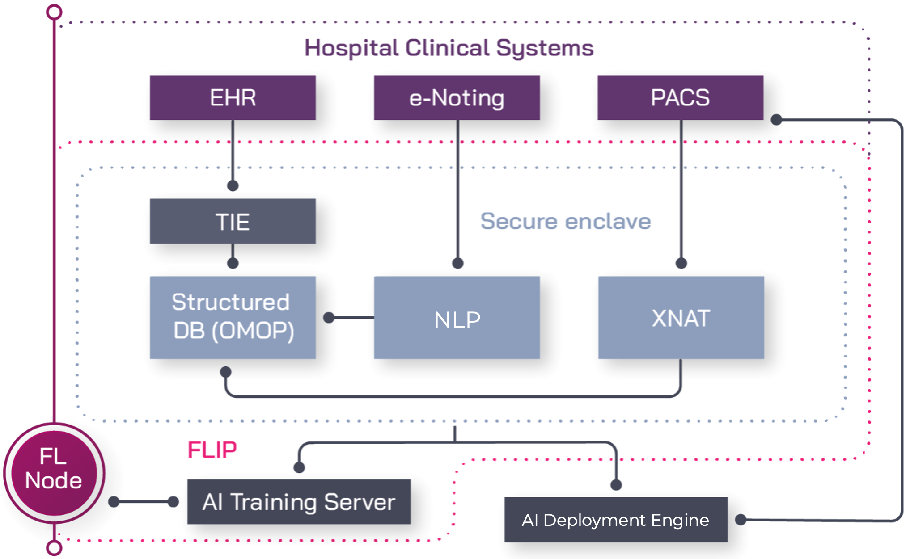

#########
Overview
#########

*************
How it works
*************

The Federated Learning Interoperability Platform (FLIP) is comprised of:

Secure Enclaves
===============

We are building dedicated secure data storage for processing and analysis within each of our partner NHS Trusts - a secure enclave or area within the firewall that keeps sensitive patient data inside the Trust.

Data from across the Trusts' patient records systems will be transferred into the secure enclave for curating and aggregation, unifying medical imaging scans from :term:`PACS` and other electronic health data.

   FLIP node at a glance.

The secure enclave is comprised of multiple hardware and software components. Training runs on the Trust's own GPU hardware: a FLIP node requires at least one NVIDIA GPU and the NVIDIA Container Toolkit, so the federated learning containers can train against local imaging without any of it leaving the Trust.

XNAT, an open-source image informatics platform that ingests Digital Imaging and Communications in Medicine (DICOM, the industry-standard for medical images and related data) images from PACS, allows us to run our algorithms against automatically anonymised images safely.

Alongside the imaging, structured clinical data from the Trust's records is harmonised into an OMOP Common Data Model database, which is what a project's cohort query is run against to select the patients and studies a model trains on.

A secure enclave (FLIP node) is created at partner sites and networked with the FLIP central hub.

Federated Learning
===================

AI algorithms need to train on diverse clinical datasets from multiple sources to ensure the resulting model is both reliable and generalizable.

Our federated learning approach brings algorithms to the data within each NHS Trust's secure enclave, without needing to share information outside the secure firewall or break local governance rules.

Algorithmic models are sent to multiple Trusts and trained on local data before being securely combined to achieve consensus. The model is then applied within each secure enclave, where it learns from the data, is updated again, and the process repeated until an improved consensus model is created.

To achieve convergence, the process of learning and combining is reiterated, until each locally applied model reaches the same conclusion, indicating that the model is generalizable and can be consistently applied.

Interoperability and data harmonisation
========================================

Electronic healthcare records are complex and heterogeneous, making it difficult to create interoperable algorithms that can be applied to data that is stored and categorised in different ways across multiple sites.

To harmonise this heterogeneous data, we use ontological and data interoperability standards to structure the data and make it actionable. When data is standardised and harmonised across multiple hospitals and clinical systems, it is possible for AI algorithms to query, learn and action data via an open standards-based data interface. This consistency makes interoperability possible, allowing researchers to extract valuable insights from multiple data sources.

*******************
How FLIP adds value
*******************
Our Federated Learning Interoperability Platform (FLIP) ensures a high level of fidelity in AI output models compared to traditional aggregative data strategies because the data it trains on never leaves the Trust that holds it. Imaging is anonymised by XNAT as it arrives in the secure enclave, and models train on it in place — only model weights cross the Trust boundary, so no patient data has to be extracted, pooled or de-identified for sharing.

FLIP also allows us to adhere to each Trust's governance and data privacy regulations and ensures that our models are scalable in international contexts in full compliance with international laws and guidance.
