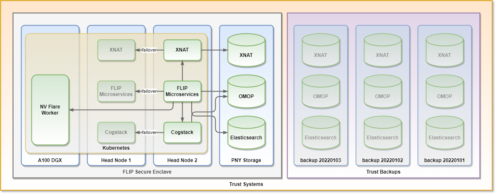

################
Platform Support
################

*********
Security
*********

Trusts authenticate to the Central Hub using per-trust API keys. Each trust is identified by its ``TRUST_NAME`` and a secret ``TRUST_API_KEY`` — the hub verifies the SHA-256 hash of the key against its stored ``TRUST_API_KEY_HASHES``. Trust communication payloads are encrypted with a shared ``AES_KEY_BASE64``.

See :ref:`deploy-flip-node-on-prem` for details on trust provisioning and authentication setup.

***********
Networking
***********

All trust communication is **outbound** — trusts poll the Central Hub for tasks over HTTPS (via the ALB). 
The hub never makes inbound connections to trusts. FL clients connect outbound to the FL server via the NLB. 
No inbound firewall rules or port forwarding are required on trust hosts.

Both the Central Hub and Trust EC2 instances run in private subnets with no open inbound ports. 
Operator access is via AWS Systems Manager Session Manager (SSH-over-SSM). 
XNAT, Orthanc, and the Trust API swagger docs are accessible via SSM port forwarding only (``make forward-trust``).

In production, trust-to-hub communication will be carried over a site-to-site VPN between each Trust's network and the Central Hub VPC, providing an
encrypted tunnel for all outbound polling and FL client traffic in addition to the application-layer protections described above. This is not yet implemented
— current deployments rely on HTTPS over the public internet — but is planned as part of the production rollout.

.. figure:: ../assets/support/flip_architecture-flip_network_architecture.png
   :align: center

   FLIP network architecture.

The following is the list of ports required to be opened for the Secure Enclave communication:

.. list-table:: Firewall Rules
   :header-rows: 1
   :widths: 50 25 25
   :align: center

   * - Description
     - Inbound
     - Outbound
   * - SSH traffic for installation and updates
     - 22
     -
   * - DICOM ingestion from PACS / modality
     - 8081
     -
   * - Grafana access
     - 2632
     -
   * - Kibana access
     - 32010 / 15601
     -
   * - Orthanc system access
     - 4242 / 8042
     -
   * - Orthanc debugging access
     - 4245 / 8045
     -
   * - FLIP API
     - 8000-8003
     -
   * - Kubernetes ingress ports
     - 32472 / 32473
     -
   * - Kubernetes control port
     - 6443
     -
   * - FLIP communication ports
     -
     - 30001 - 30100
   * - Connection from XNAT to local PACS systems
     -
     - local PACS ports
   * - VPN traffic
     -
     - 500 / 4500

*****************
Backup / Restore
*****************

Types of Data
=============

As a system, the FLIP solution handles the following types of data:

1. Persistent OMOP Common Data Model data, covering demographic, diagnosis and imaging details.
2. Transient XNAT cached image data, potentially enriched locally with segmentation, labelling, etc., sourced from Trust PACS.
3. Log files including event logs and other information generated as part of the operation of the system.

Backup
======

The data partitions for the PostgreSQL (OMOP), XNAT and Loki (log files) instances are all mounted on the dedicated storage array. This is a RAID 6 PNY appliance with high resilience.

Backup scripts will be run daily to backup each data store to a /backups/ directory on the storage appliance. This should be backed up up by the Trust using their specific backup process, ideally overnight.

   FLIP backups.

******
Access
******

Access to FLIP is granted by a FLIP administrator.

Access to FLIP will be reviewed annually, with dormant accounts being removed.

FLIP employs role based access control to permit functionality for accounts, managed through the FLIP API and UI. FLIP currently has three access profiles: **Admin**, **Researcher** and **Observer**. For full details of permissions assigned to each role, see :ref:`rbac-roles`.
