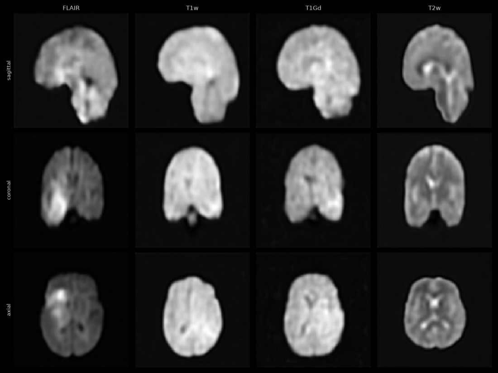

# Latent Diffusion Model — FLIP tutorial

This tutorial trains a **`DiffusionModelUNet` inside a frozen autoencoder's latent space** on **3-D
brain MRI**, **conditioned on the MR sequence**, using the **NVFLARE Client API** (`nvflare.client`). The job is defined entirely in
Python via `FlipFedAvgRecipe` — no hand-written JSON configs required. The code is entirely based on
`MONAI` functions.

**The autoencoder is not trained here — you supply it.** That is the one thing that makes this
tutorial different from its two siblings, and it is why it needs a model uploaded alongside its app
files.

It is one of three tutorials that between them cover generative image synthesis on FLIP:

| Tutorial | Trains | Operates on | Needs an uploaded model? |
| --- | --- | --- | --- |
| [`autoencoder`](../autoencoder/) | `AutoencoderKL` + `PatchDiscriminator` | 3-D brain MRI | no |
| [`diffusion_model`](../diffusion_model/) | `DiffusionModelUNet` | 2-D chest X-rays, in pixel space | no |
| **`latent_diffusion_model`** (this one) | `DiffusionModelUNet` | latents of a frozen autoencoder, 3-D brain MRI | **yes** — the autoencoder |

Each is an **independent single-stage job**, so you can train an autoencoder once and re-use it
across many diffusion runs, or bring one you already have.

Validation reports the noise-prediction MSE on each site's held-out split.

**New to this?** Read [`diffusion_model`](../diffusion_model/) first — same denoising objective,
without the frozen autoencoder or any of the latent machinery.

## Example outputs from this tutorial



Volumes generated by running this tutorial (from left to right, samples conditioned on FLAIR, T1w, T1Gd, T2w).


## Data

The **brain MRI** cohort — MSD Task01_BrainTumour (see
[`fl-tutorials/datasets/brain_mri/`](../../../datasets/brain_mri/)), the same cohort and the same
`transforms.py` as the [`autoencoder`](../autoencoder/) tutorial: four co-registered MR sequences per
study (FLAIR, T1w, T1Gd, T2w), each a single-channel NIfTI, resampled to **96³** and scaled to
[0, 1]. The autoencoder compresses that to a **24³ latent with 3 channels**.

```bash
make -C fl-tutorials download-brain-mri-msd-raw            # 7.6 GB MSD tar, once
make -C fl-tutorials download-brain-mri-data NUM_CASES=20  # -> data/brain_mri/
```

The autoencoder you supply must have been trained on the same kind of image at the same size — in
practice, by the [`autoencoder`](../autoencoder/) tutorial on this cohort.

## Conditioning on the MR sequence

This is the one thing this tutorial does that neither sibling does. The model is **told which
sequence it is denoising**: the modality is one-hot encoded and fed to the UNet as a length-1
cross-attention sequence (`app_files/modality.py`). That is what makes a single model able to
generate a T2w *or* a T1Gd volume on demand, rather than an average of the four.

Two `config.json` knobs control it, and **they must move together**:

```json
// conditioned on all four sequences (shipped)
"MODALITIES": ["FLAIR", "T1w", "T1Gd", "T2w"],
"net_config": { "diffusion_model": { "with_conditioning": true,  "cross_attention_dim": 4 } }

// unconditional, single sequence
"MODALITIES": ["T1w"],
"net_config": { "diffusion_model": { "with_conditioning": false, "cross_attention_dim": 0 } }
```

`MODALITIES` decides which sequences enter the cohort at all; `cross_attention_dim` decides how many
classes the attention layers are built for. The pairing is pinned by
`fl-tutorials/tests/test_image_synthesis_config_parity.py`, because each way of getting it wrong
fails differently and none of them fails helpfully:

| Mistake | What happens |
|---|---|
| `cross_attention_dim` > `len(MODALITIES)` | trains happily on dead one-hot columns |
| `cross_attention_dim` < `len(MODALITIES)` | raises, but only once a real batch reaches the UNet — on a trust, mid-round |
| `with_conditioning: false` with four modalities | trains an unconditional model on four mixed sequences; the result is a blurred average that reads as slow convergence |
| `cross_attention_dim` ≠ 0 with `with_conditioning: false` | builds cross-attention layers nothing ever feeds |

**Order is part of the contract, not just membership.** The index into `MODALITIES` *is* the one-hot
position, so the list here must match the autoencoder tutorial's exactly — same labels, same order.
Two lists with the same four labels in a different order would train the autoencoder on the same
pixels but teach this model to call a T2w volume a FLAIR. That too is pinned by a test.

Each file's sequence is read from its filename; see the autoencoder tutorial's *Data* section for how
that works on both the simulator and the platform.

## Compatible job type

These files are compatible with `JOB_TYPE=standard` in the base application
([`fl-apps/nvflare/standard/`](../../../../fl-apps/nvflare/standard/)). The required upload set is
`trainer.py`, `config.json`, `models.py`; `transforms.py`, `latent_utils.py` **and the autoencoder
checkpoint** are uploaded alongside them.

This tutorial does not use `JOB_TYPE=diffusion_model`. That job type is the platform's *two-stage*
autoencoder-then-diffusion job, and none of these three tutorials uses it.

## Getting the autoencoder (do this first)

The frozen encoder is declared by `SERVER_CHECKPOINT` in `app_files/config.json` and must exist as
`app_files/pretrained_autoencoder.pt`. A finished [`autoencoder`](../autoencoder/) run does not hand
you one directly — its checkpoint is an NVFLARE persistor file wrapping the *whole* training network
(autoencoder **and** discriminator). `process_tools/extract_autoencoder.py` converts it:

```bash
# 1. Train an autoencoder (or use one you already have)
make -C fl-tutorials run-tutorial TUTORIAL=autoencoder

# 2. Extract the autoencoder-only checkpoint from that run's result
make prepare-checkpoint RAW_CHECKPOINT=<path to that run's .pt>
```

`prepare-checkpoint` unwraps the persistor envelope (the state dict sits under a `"model"` key),
keeps only `autoencoder.*`, and writes **two** files, which are one artifact and must never be staged
apart:

| File | What it is | Where it goes |
|---|---|---|
| `app_files/pretrained_autoencoder.pt` | the weights | server only (`SERVER_CHECKPOINT`) |
| `app_files/autoencoder_config.yaml` | the architecture those weights belong to | every client, in the app bundle |

The YAML is what `models.py` builds the frozen autoencoder from, which is why the architecture is
**not** duplicated in this tutorial's `config.json`. Clients need it precisely because they *don't*
get the checkpoint: they build a bare autoencoder and receive the weights in the round-0 broadcast,
so they have to know its shape up front.

Dropping `discriminator.*` is about file size and a clean load log rather than correctness — the
persistor loads `strict=False`, so leftover keys would merely be reported as unexpected.

Re-running `prepare-checkpoint` when both files already exist **verifies** them instead of skipping:
it instantiates the recorded architecture and compares it to the checkpoint's own tensors, key by key
and shape by shape, so a checkpoint from a differently-shaped autoencoder is caught here instead of
being silently declined at load time.

**The checkpoint is the only thing you upload as a model file.** There is no diffusion-model checkpoint to provide,
empty or otherwise: the server builds the full network from `models.py` — autoencoder plus a freshly
initialised diffusion model — and fills in the autoencoder half from your upload before round 0. The
two models stay separate everywhere else: each is trained by its own job, and the autoencoder's
weights are never updated here.

### Checking that the autoencoder weights loaded

If the autoencoder weights don't load, training still runs and the losses still look normal, but
the diffusion model is learning from a randomly initialised encoder. The server loads the checkpoint
with `strict=False`, so two mistakes can cause this without any error:

1. **Renaming the `autoencoder` submodule** in either tutorial's `models.py`. The weights are saved
   under `autoencoder.*`, so with a different name none of them match.
2. **Using a `pretrained_autoencoder.pt` and an `autoencoder_config.yaml` from different runs.**
   Most mismatches change a tensor shape and fail with an error, but some settings, such as
   `norm_num_groups`, don't, so the wrong config loads without complaint. Always generate the two
   files together with `make prepare-checkpoint`.

To confirm the weights loaded, find `Loaded backbone into initial global model from …` in the server
log. `missing` should only count the diffusion model's tensors, which aren't in the checkpoint: 496
with the shipped config. The autoencoder adds another 130, so a number above 496 means some of its
weights were not loaded.

## How the frozen autoencoder reaches the clients

Clients need the autoencoder to encode images into latents, but they never receive the file:

1. `SERVER_CHECKPOINT` names the file. `InitialCheckpointPTModelPersistor` loads it **server-side**
   into the round-0 global model, so round 0 broadcasts a full model — your autoencoder plus a
   freshly-initialised diffusion model.
2. `AGGREGATE_ONLY_REGEX` (`^diffusion_model\.`) then keeps only the diffusion model on the wire.
   Clients return only `diffusion_model.*` diffs (`KeepOnlyVars` — 494 of 624 tensors), the server
   broadcasts only those after round 0 (`TrimBroadcastVars`), and each client rebuilds the full model
   from its cached round-0 broadcast (`ReconstructFullModel`).

In production the checkpoint never enters the job bundle at all: flip-api's bundler diverts any file
named by `SERVER_CHECKPOINT` to `<bucket>/server_checkpoints/`, and the FL API stages it to
`<SERVER_CHECKPOINT_ROOT>/<model_id>/` on a hub-local volume no client can read. (Locally, the export
produces a single shared `app/` dir, so the checkpoint sits in the one `custom/` directory — which is
exactly where the persistor looks for a simulator run.)

### `AGGREGATE_ONLY_REGEX` is not only a bandwidth saving

It is also a **privacy** control. `PercentilePrivacy` computes its cutoff over *all* variables
concatenated together, not per-variable, and zeroes everything below the 10th percentile by default.
The frozen autoencoder is **~51%** of this network's parameters (20.9M against the diffusion model's
20.3M) and its diffs are exactly zero, so leaving them in the update puts that cutoff at exactly zero
— a majority of the values *are* zero, so any percentile below the 51st lands there. At that point the
DP sparsification stops discarding anything and quietly degrades to the `gamma` clip alone. Keeping
the autoencoder out of the update is what keeps the cutoff meaningful, and at this ratio it is not a
marginal effect.

## The latent scale factor (`LATENT_SCALE_FACTOR`)

The diffusion model trains on latents normalised by a scale factor. By default that factor is derived
from a **local** batch, which means every site derives a slightly different one and their updates are
not averaging quite-comparable models. With a frozen autoencoder the factor is a fixed property of
that autoencoder and the data, so you can pin it:

```json
"LATENT_SCALE_FACTOR": 1.234
```

Set it and every site uses that exact value — **recommended for any real multi-site run**. Leave it
`null` and each site derives it from its first batch. Either way the resolved
value is logged, so you can read the derived numbers off a first run and pin the result.

## Learning rate schedule and gradient clipping

```json
"LR_START": 0.0001,
"LR_END": 0.000001,
"LR_DECAY_EPOCHS": 200,
"GRAD_CLIP_NORM": 1.0
```

The rate follows half a cosine from `LR_START` down to `LR_END` over the first `LR_DECAY_EPOCHS`
epochs, then holds at `LR_END`. It is stepped once per epoch, and the epoch count
runs across rounds: round 2 continues from where round 1 left off rather than restarting the decay.
Leave `LR_END` or `LR_DECAY_EPOCHS` out, or set `LR_DECAY_EPOCHS` to `0`, to keep the rate at `LR_START`. The current rate is logged
as `LR DM@epoch`.

Why decay at all: the noise-prediction loss flattens within a few dozen epochs, but at a constant
`1e-4` the weights keep moving. With only a few dozen studies per site, that is enough to knock out
one modality's conditioning between two sample grids, even while the loss stays flat.

`GRAD_CLIP_NORM` caps the global gradient norm of the diffusion UNet once per optimizer step, after
gradient accumulation and after the GradScaler has been unscaled. `0` turns clipping off.

## Debugging

### Sample images

Written only when **all three** hold:

| Condition | Set by |
| --- | --- |
| `"SAVE_DEBUG_SAMPLES": true` | you, in `config.json` (ships `false`) |
| `LOCAL_DEV=true` | the simulator (every trust sets `false`) |
| `DEBUG_SAMPLES_DIR` set | `make run` / `make sim` only |

At a trust the last two never hold, so **production never writes images, whatever `config.json`
says**. The check is `samples_enabled()` in `app_files/plot_utils.py`.

- **Where:** `fl-tutorials/data/debug_samples/latent_diffusion_model/` (gitignored). Nothing sends them to the server.
- **When:** every `VALIDATE_EVERY` epochs, on each round's last epoch, and in the round-end `validate` task. Sampling is a full reverse diffusion (minutes), so keep `VALIDATE_EVERY` well above 1; `0` leaves only the round-end pass.
- **What:** a tri-planar figure of generated volumes, one column per modality, `samples_site-<N>_step<epoch>.png`.

Samples are also the check that the frozen autoencoder loaded: its load is `strict=False`, so a bad
checkpoint still trains and only shows up here as noise. After one round samples are noise anyway;
check the server log instead, where `unexpected=0` means every checkpoint key was used:

```
InitialCheckpointPTModelPersistor - Loaded backbone ... (missing=494, unexpected=0 keys).
```

### Loss curves

```bash
DEBUG_SAMPLES_DIR=../../../data/debug_samples/latent_diffusion_model python app_files/plot_utils.py
```

Reads the simulator logs and writes `losses_<site>.png` next to the samples. Runs on your machine
only, never at a trust.

## Rounds configuration

`app_files/config.json` carries `GLOBAL_ROUNDS` (federated rounds) and `LOCAL_ROUNDS` (local epochs
per round). These names are load-bearing: with a single local-rounds key, the FL API requires it to be
called exactly `LOCAL_ROUNDS` and rejects the job otherwise.

## FLIP-specific values

`FLIP_PROJECT_ID` and `FLIP_QUERY` are read from environment variables (set stubs in `.env.app`).
They are NOT passed as CLI flags because the SQL query contains spaces that don't survive argparse
whitespace-splitting. The trainer reads the query from `config_fed_client.json` at runtime via
`load_query()`.

## How to run

### Export (primary — no GPU needed)

```bash
make export
```

Writes a complete NVFLARE job to `./fl_job/flip_fedavg/` (`meta.json`, `app/config/`,
`app/custom/`). This is the fastest way to verify the job wiring, and deliberately does **not**
require the checkpoint. Worth inspecting in the export:

- `config_fed_client.json` — `keep_only_trainable_vars` ordered **before** `percentile_privacy`
  (that order is what keeps the DP cutoff off the frozen autoencoder's zeros), plus
  `reconstruct_full_model`.
- `config_fed_server.json` — `trim_broadcast_to_trainable` and `InitialCheckpointPTModelPersistor`.

### Local simulation (requires a GPU + the dataset + the checkpoint)

```bash
make -C ../../.. download-brain-mri-msd-raw   # 7.6 GB, once
make -C ../../.. download-brain-mri-data      # -> data/brain_mri/
make prepare-checkpoint RAW_CHECKPOINT=... # see "Getting the autoencoder" above
make run                                   # delegates to `make sim`
```

Or via the shared harness:

```bash
make -C fl-tutorials run-tutorial TUTORIAL=latent_diffusion_model
```

Knobs: `NUM_ROUNDS` (default 1), `N_CLIENTS` (default 2) — override per invocation
(`make run NUM_ROUNDS=2`) or in `.env.app`. In simulation the two sites train on different halves of
the dev dataset; in production each trust's cohort is already its own.

### Clean

```bash
make clean
```
