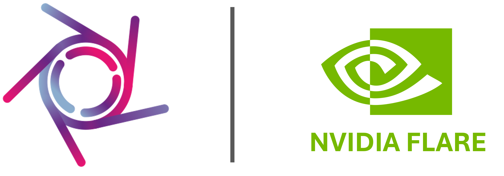
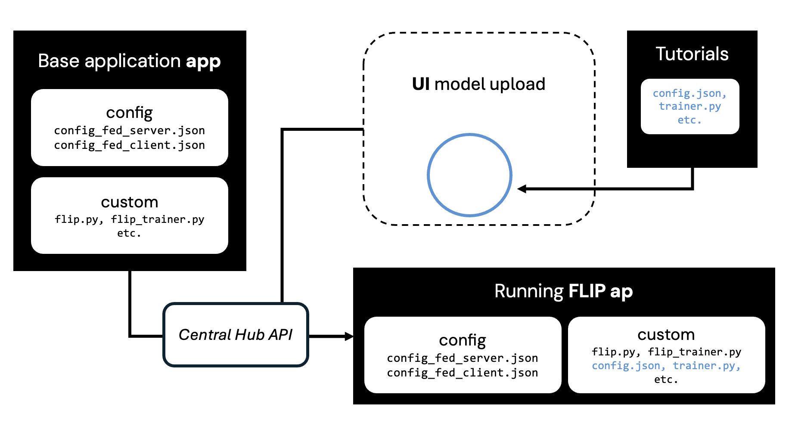

<!--
    Copyright (c) 2026 Guy's and St Thomas' NHS Foundation Trust & King's College London
    Licensed under the Apache License, Version 2.0 (the "License");
    you may not use this file except in compliance with the License.
    You may obtain a copy of the License at
        http://www.apache.org/licenses/LICENSE-2.0
    Unless required by applicable law or agreed to in writing, software
    distributed under the License is distributed on an "AS IS" BASIS,
    WITHOUT WARRANTIES OR CONDITIONS OF ANY KIND, either express or implied.
    See the License for the specific language governing permissions and
    limitations under the License.
-->

# flip-utils — the `flip` Python package

<p align="left">

</p>

[](https://pypi.org/project/flip-utils/)
[](https://www.python.org/downloads/)
[](https://londonaicentreflip.readthedocs.io/en/latest/)[](../LICENSE.md)

This directory is a sub-tree of the [FLIP](https://github.com/londonaicentre/FLIP) mono-repo. It hosts the
pip-installable `flip` Python package (published as `flip-utils` on PyPI) that ships inside every FL server / client
image and is imported as `from flip import ...` by user-uploaded training code. Sibling FL trees in the same mono-repo:

- **[`flip-utils/flip/`](./flip/)** — pip-installable Python package with platform logic, NVFLARE components, and utilities (this directory)
- **[`../fl-apps/`](../fl-apps/)** — FL job-type implementations / app templates (`standard`, `evaluation`, `diffusion_model`, `fed_opt`)
- **[`../fl-tutorials/`](../fl-tutorials/)** — runnable end-to-end tutorial examples
- **[`../fl-services/`](../fl-services/)** — Docker images for FL networks (server, clients, admin API)

The rest of this README is still being reconciled with the mono-repo layout — paths like `tutorials/` and `fl-services/` referred to here are
the now-sibling top-level `fl-tutorials/` and `fl-services/` trees, and Make targets called out below run from the
`flip-utils/` directory.

## Table of Contents

- [flip Python Package](#flip-python-package)
  - [Installation](#installation)
  - [Package Structure](#package-structure)
  - [User Application Requirements](#user-application-requirements)
  - [Job Types](#job-types)
  - [Development Mode](#development-mode)
  - [Unit Tests](#unit-tests)
- [Tutorials](#tutorials)
  - [App / Tutorial Compatibility](#app--tutorial-compatibility)
- [FL Services API](#fl-services-api)
  - [Prerequisites](#prerequisites)
  - [Provisioning a Network](#provisioning-a-network)
  - [Running the Network](#running-the-network)
  - [Integration Testing](#integration-testing)
  - [CI/CD](#cicd)
  - [Makefile Reference](#makefile-reference)
- [Security](#security)
- [Contributing](#contributing)

---

## flip Python Package

The [`flip`](./flip/) package is the core pip-installable library for the FLIP federated learning platform. It provides
all platform logic core to training and evaluating FL applications.

### Installation

```bash
uv sync
# or
pip install .
```

To build a distributable package:

```bash
uv build
```

### Package Structure

```text
flip/
├── core/         # FLIPBase, FLIPStandardProd/Dev implementations, FLIP() factory
├── constants/    # FlipConstants (pydantic-settings), enums, PTConstants
├── utils/        # General utilities: Utils, model weight helpers
├── nvflare/      # NVFLARE-specific logic and components
│   ├── executors/    # RUN_TRAINER, RUN_VALIDATOR, RUN_EVALUATOR wrappers
│   ├── controllers/  # Workflow controllers (ScatterAndGather, CrossSiteModelEval, …)
│   └── components/   # Event handlers, persistors, privacy filters, locators, …
└── flower/       # Flower-specific server-side helpers
    └── metrics.py    # handle_client_metrics / handle_client_exception
```

The `FLIP()` factory selects `FLIPStandardDev` (local CSV/filesystem) or `FLIPStandardProd` (FLIP platform APIs) based
on the `LOCAL_DEV` environment variable.

The `flip.flower` sub-package is intended **only for fl-server code**. Its helpers forward per-client metrics and
crashed-reply exceptions — extracted from Flower reply Messages in `Strategy.aggregate_train` /
`aggregate_evaluate` — to the Central Hub. fl-client containers must never import it and must never hold the
`INTERNAL_SERVICE_KEY` credential. For the NVFLARE equivalent, see `flip.nvflare.metrics`.

### User Application Requirements

User-provided files go in the job's `custom/` directory and are dynamically imported by the executor wrappers:

| File | Description |
| ------ | ------------- |
| `trainer.py` | Training logic — must export `FLIP_TRAINER` class |
| `validator.py` | Validation logic — must export `FLIP_VALIDATOR` class |
| `models.py` | Model definitions — must export `get_model()` function |
| `config.json` | Hyperparameters — must include `LOCAL_ROUNDS` and `LEARNING_RATE`; optional: `BEST_MODEL_METRIC` and `BEST_MODEL_METRIC_MINIMIZE` for best-model selection |
| `transforms.py` | Data transforms (optional) |

### Job Types

Set via the `JOB_TYPE` environment variable:

| Type | Description |
| ------ | ------------- |
| `standard` | Federated training with FedAvg aggregation (default) |
| `evaluation` | Distributed model evaluation without training |
| `diffusion_model` | Two-stage training (VAE encoder + diffusion) |
| `fed_opt` | Custom federated optimization |

The corresponding configs live in `fl-apps/nvflare/<job_type>/app/config/`.

### Best Model Selection (Optional)

By default, the final aggregated model is saved after training. To also save the **best model** based on a validation metric:

Add to your `config.json`:

```json
{
  "BEST_MODEL_METRIC": "VAL_DICE",
  "BEST_MODEL_METRIC_MINIMIZE": false
}
```

| Parameter | Type | Default | Description |
| --- | --- | --- | --- |
| `BEST_MODEL_METRIC` | str | None | Validation metric label to track (e.g., `"VAL_DICE"`, `"VAL_LOSS"`, `"VAL-F1-SCORE"`). If unset, no best model is saved. |
| `BEST_MODEL_METRIC_MINIMIZE` | bool | false | Set to `true` if lower metric values are better (e.g., for loss metrics). Set to `false` if higher values are better (e.g., Dice, F1, Accuracy). |

Both final and best models are saved to the output and available for download. If best-model selection is not specified, only the final model is available.

### Development Mode

DEV mode lets you run an FL application locally on the NVFLARE simulator before
deploying. The runnable tutorials live in [`../fl-tutorials/`](../fl-tutorials/); each
carries a `.env.app` (`JOB_TYPE`, `PATH_TO_APP`, `DEV_IMAGES_DIR`, `DEV_DATAFRAME`) and
delegates to the shared harness in `fl-tutorials/nvflare/testing/`.

1. Get the tutorial's dataset. The xray tutorial pulls a reference dataset from Hugging
   Face (`make -C fl-tutorials download-xray-data`); the spleen tutorials generate their
   own data via their `utils/` scripts (see each tutorial's README).

2. Place any custom application files under the tutorial's `app_files/`; at run time
   they are merged onto the matching `fl-apps/nvflare/<JOB_TYPE>/app` template.

3. Run a tutorial on the simulator (requires GPUs + the `flare-fl-base` image):

   ```bash
   make -C fl-tutorials download-xray-data                       # xray dataset (one-off)
   make -C fl-tutorials list-tutorials
   make -C fl-tutorials run-tutorial TUTORIAL=xray_classification
   make -C fl-tutorials run-all-tutorials   # every tutorial (heavy; stops on first failure)
   ```

### Unit Tests

```bash
make unit-test
# or
uv run pytest -s -vv
```

---

## Tutorials

The [`../fl-tutorials/`](../fl-tutorials/) directory contains ready-to-use example applications that can be uploaded to the FLIP platform UI. Each tutorial is designed to work with a specific app template from `../fl-apps/`, and runs on the local NVFLARE simulator via `make -C fl-tutorials run-tutorial TUTORIAL=<name>`.



### App / Tutorial Compatibility

| App | Tutorial |
|-----|----------|
| `standard` | `image_segmentation/3d_spleen_segmentation` |
| `standard` | `image_classification/xray_classification` |
| `diffusion_model` | `image_synthesis/latent_diffusion_model` |
| `fed_opt` | `image_segmentation/3d_spleen_segmentation` |
| `evaluation` | `image_evaluation/3d_spleen_segmentation_evaluation` |

---

## FL Services API

The [`../fl-services/nvflare/`](../fl-services/nvflare/README.md) directory contains Docker-based NVFLARE services. See the [FL services README](../fl-services/nvflare/README.md) and the [FL API README](../fl-services/nvflare/fl-api-base/README.md) for full details on provisioning and the API endpoints.

### Prerequisites

- Docker and Docker Compose
- [uv](https://github.com/astral-sh/uv) (Python package manager)
- AWS CLI configured (for provisioning kit uploads to S3)

### Provisioning the 2 Networks

Generate the certificates, keys, and configuration for the 2 FL networks:

```bash
make -C fl-services/nvflare provision-2-nets
```

This uses the network-specific provisioning project files (`fl-services/nvflare/provision/net-1_project_dev.yml` and `net-2_project_dev.yml`) and provisions the network files in `fl-services/nvflare/provision/workspace-dev/net-1` and `fl-services/nvflare/provision/workspace-dev/net-2` (gitignored) using the [fl-services/nvflare/provision/scripts/provision-network.sh](../fl-services/nvflare/provision/scripts/provision-network.sh) script.

> ⚠️ **Warning**: Provisioned files contain cryptographic signatures. Any modification will cause errors. Always re-run provisioning if changes are needed.

### Provisioning Networks for Staging/Production

Note the provisioning project file `net-1_project_stag.yml` changes the name of the FL server to the full domain name i.e. `stag.flip.aicentre.co.uk` instead of `fl-server-net-1`, since the FL
clients won't be on the same Docker network as the FL server (as they are in development) and won't be able to resolve internal Docker hostnames.

Run:

```bash
make -C fl-services/nvflare provision-stag
```

### Creating a New Network

Create a provisioning project file under `fl-services/nvflare/provision/` (e.g. `net-3_project_dev.yml`) based on the template (`net-1_project_dev.yml`) (you'll likely need to change `fed_learn_port`) and run:

```bash
make -C fl-services/nvflare provision NET_NUMBER=3
```

### Running a Network

From ``fl-services/nvflare/`` (the per-backend Makefile that owns these targets — the
``flip-utils/`` directory itself only ships ``unit-test``):

```bash
make build                # Build the :dev FL images (flare-fl-{base,server,client,api})
make up NET_NUMBER=1      # Start the network (server, 2 clients, API)
make down NET_NUMBER=1    # Stop the network — must match the NET_NUMBER used for `up`
                          # (compose embeds it in container names + mount paths)
```

### Running the tutorials

Each NVFLARE tutorial runs on the local simulator via the [`fl-tutorials/`](../fl-tutorials/)
Makefile. Download the tutorial's dataset first (see its README), then:

```bash
make -C fl-tutorials run-tutorial TUTORIAL=xray_classification
make -C fl-tutorials run-all-tutorials
```

### CI/CD

GitHub Actions workflows use OIDC to authenticate to AWS (no long-lived keys).

| Trigger | Target (where `fl-apps/<backend>/` is synced) | Workflow |
| --------- | -------- | -------- |
| PR opened/updated (head) | `s3://<dev-bucket>/base-application-dev/pull-requests/<PR_NUMBER>/<backend>` | `fl-apps-push-pr-s3.yml` |
| Merge to `develop` | `s3://<dev-bucket>/base-application/<backend>` (+ stag account) | `fl-apps-push-s3-dev.yml`, `fl-apps-push-s3-stag.yml` |
| Merge to `main` | `s3://<prod-bucket>/base-application/<backend>` | `fl-apps-push-s3-prod.yml` |

Each workflow triggers only when its backend's templates change (`fl-apps/nvflare/**` for the
files above; a `…-flower.yml` sibling covers `fl-apps/flower/**`). The PR-scoped copy is removed on
merge by `fl-apps-cleanup-pr-s3.yml`, and after merge the develop/main sync makes the templates
available on the canonical path automatically — so the per-PR copy is only for **pre-merge** testing.

> **Warning**: Never manually sync to the production bucket.

To exercise a PR's templates on a running FLIP stack **before merge**, point `FL_APP_BASE_BUCKET` at
the PR's *parent* path — `s3://<dev-bucket>/base-application-dev/pull-requests/<PR_NUMBER>` (flip-api
appends `/<backend>/<job_type>`) — and restart flip-api. flip-api validates the job type against the
synced `required_files.json` manifest, so a new job type needs no flip-api code change — only the
synced template.

> **Bucket gotcha:** the PR/merge sync workflows write to `AWS_DEV_S3_BUCKET_NAME` (the `flipdev`
> bucket: `s3://flipdev/base-application-dev/pull-requests/<N>/<backend>`), which is **not** the same
> bucket flip-api's default `FL_APP_BASE_BUCKET` reads (`FLIP_APP_BUNDLES_BUCKET_NAME`, the
> `flipdev-app-bundles` bucket). So the repoint must use the `flipdev` PR path — pointing at
> `flipdev-app-bundles/...pull-requests/...` 404s (empty manifest → `Unknown job_type` at run).

### Makefile Reference

#### Network Management

| Command | Run from | Description |
| --------- | --------- | ------------- |
| `make -C fl-services/nvflare provision NET_NUMBER=X` | repo root | Provision FL network X |
| `make -C fl-services/nvflare provision-2-nets` | repo root | Provision both dev FL networks |
| `make build` | `fl-services/nvflare/` | Build the :dev FL images |
| `make up NET_NUMBER=X` | `fl-services/nvflare/` | Start FL network X |
| `make down NET_NUMBER=X` | `fl-services/nvflare/` | Stop FL network X (must match the `NET_NUMBER` used at `up`) |

#### Testing

| Command | Description |
| --------- | ------------- |
| `make unit-test` | Run pytest unit tests for flip python package |

#### Running tutorials (from the repo root)

| Command | Description |
| --------- | ------------- |
| `make -C fl-tutorials download-xray-data` | Fetch the xray_classification dataset from Hugging Face |
| `make -C fl-tutorials list-tutorials` | List the runnable NVFLARE tutorials |
| `make -C fl-tutorials run-tutorial TUTORIAL=<name>` | Run one tutorial on the local simulator |
| `make -C fl-tutorials run-all-tutorials` | Run every tutorial (heavy; stops on first failure) |

Each tutorial's dataset is downloaded per-tutorial — see the tutorial's own README.

---

## Security

Please report security vulnerabilities responsibly. For details on how to report a vulnerability, see [SECURITY.md](./SECURITY.md).

**⚠️ Do not open a public GitHub issue for security bugs; instead, use the private GitHub Security Advisory feature.**

---

## Contributing

For information on how to contribute to this project, see [CONTRIBUTING.md](./CONTRIBUTING.md).
